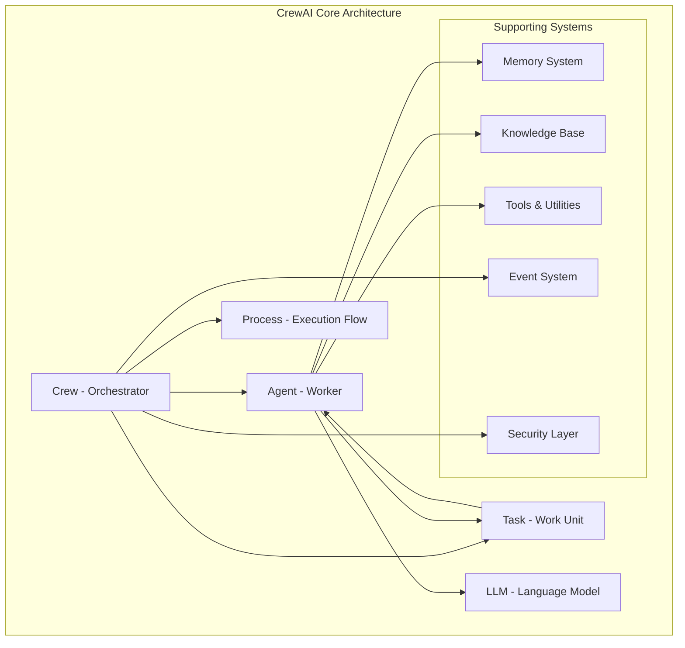
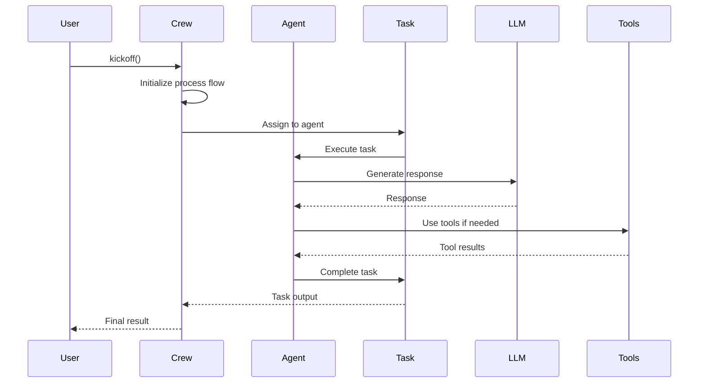
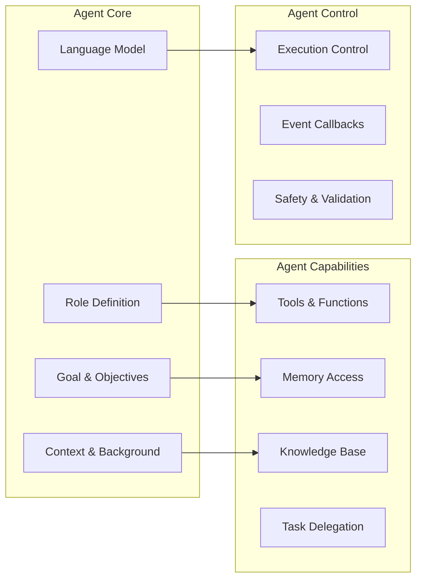
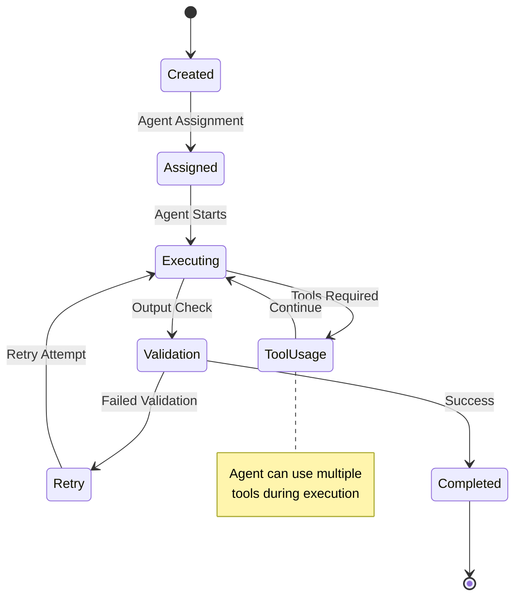
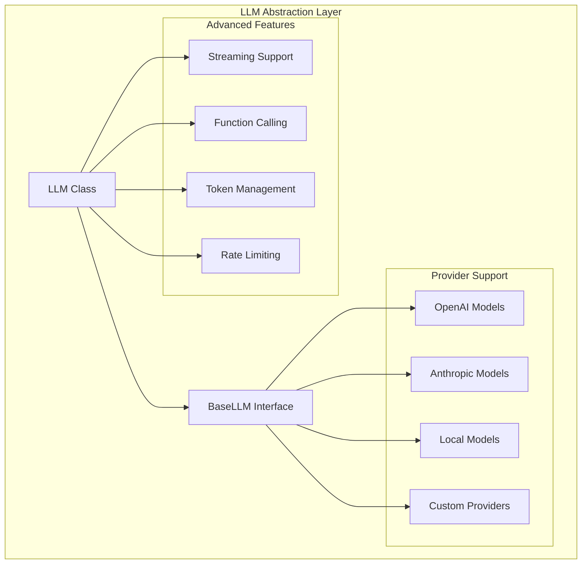
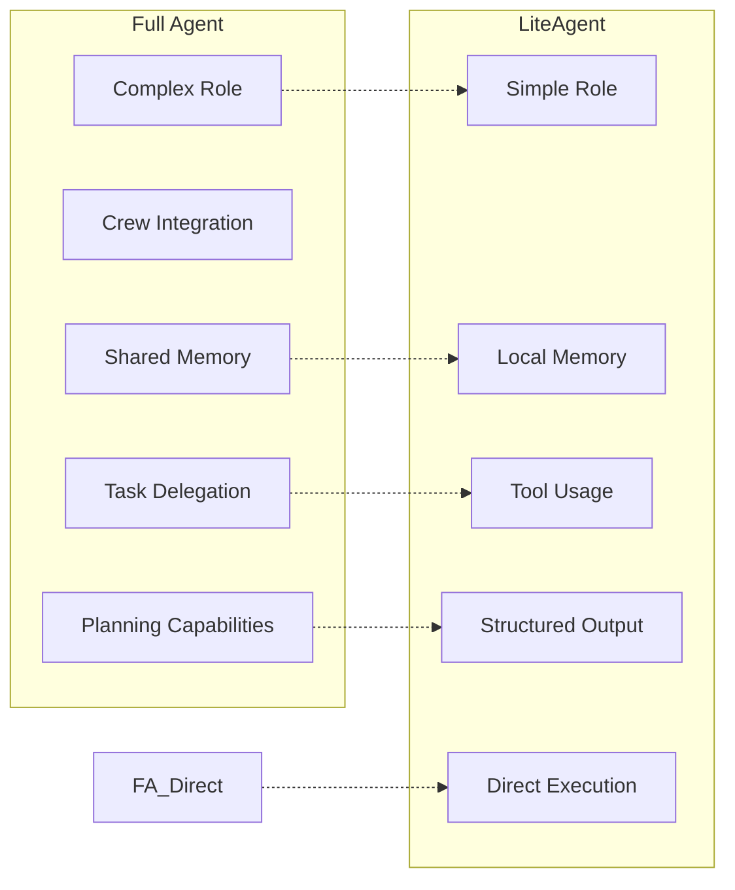
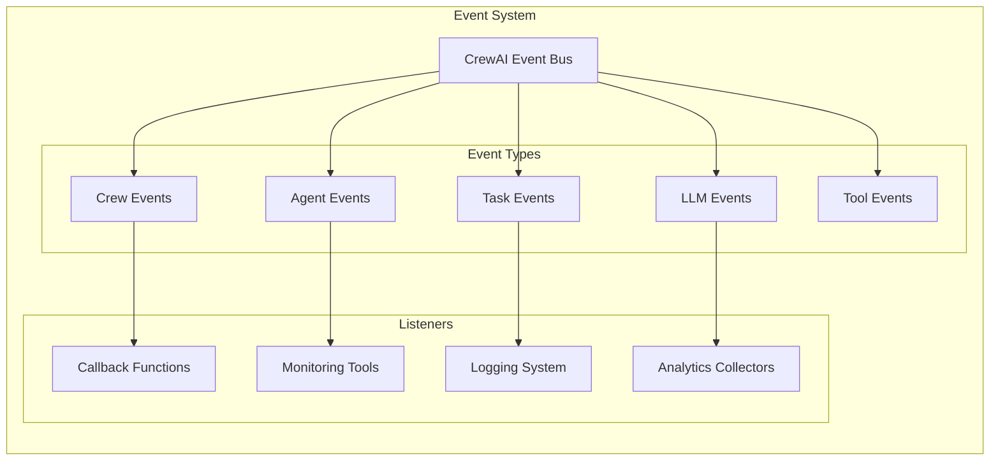
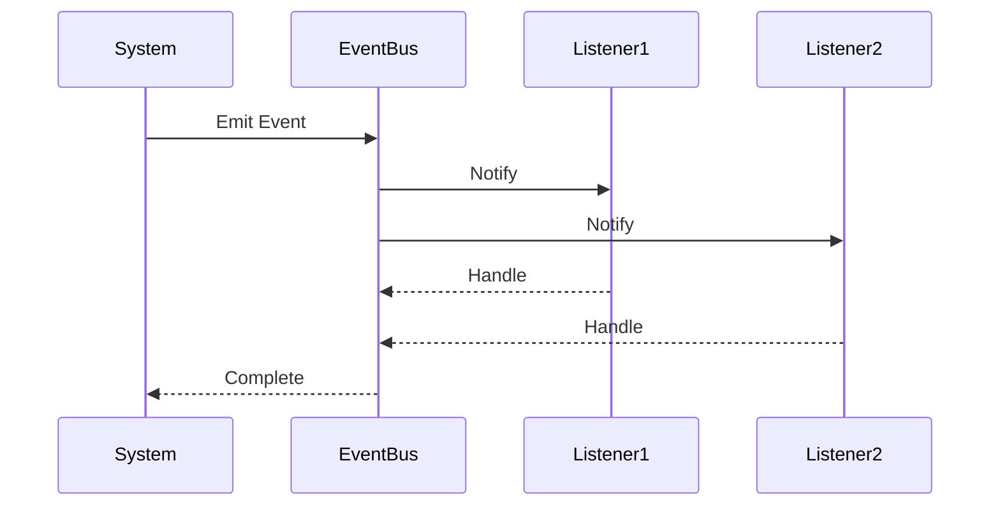
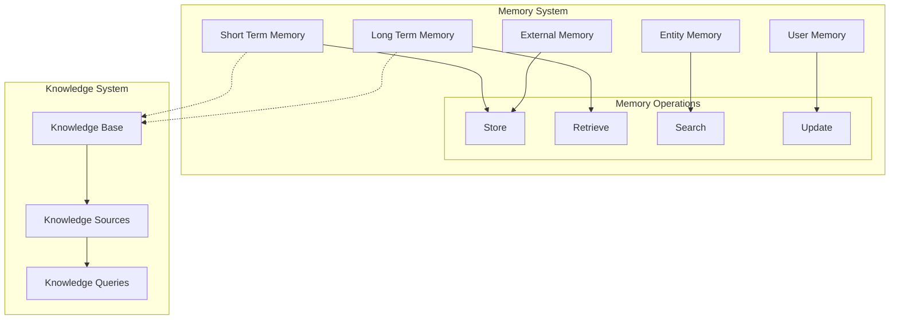

# CrewAI Architecture Deep Dive: Complete Guide for Building Custom Agentic Libraries

## Table of Contents
1. [Introduction](#introduction)
2. [Core Architecture Overview](#core-architecture-overview)
3. [Component Analysis](#component-analysis)
4. [Design Patterns](#design-patterns)
5. [Event System Architecture](#event-system-architecture)
6. [Memory and Knowledge Management](#memory-and-knowledge-management)
7. [Security and Configuration](#security-and-configuration)
8. [Extension Points](#extension-points)
9. [Implementation Recommendations](#implementation-recommendations)

## Introduction

CrewAI is a sophisticated multi-agent framework that orchestrates AI agents to work collaboratively on complex tasks. This document provides an in-depth analysis of its architecture, design patterns, and implementation details to help you build a more customizable agentic library.

## Core Architecture Overview



### Key Components Interaction Flow



## Component Analysis

### 1. Crew Class - The Orchestrator

**File**: `crew.py`

The Crew class is the central orchestrator that manages the entire multi-agent workflow.

#### Key Responsibilities:
- **Agent Management**: Coordinates multiple agents and their interactions
- **Task Distribution**: Assigns tasks to appropriate agents based on capabilities
- **Process Flow Control**: Manages sequential, hierarchical, or custom execution flows
- **Memory Coordination**: Handles shared memory across agents
- **Result Aggregation**: Combines outputs from multiple agents

#### Core Attributes:
```python
class Crew(FlowTrackable, BaseModel):
    # Core Components
    tasks: List[Task] = Field(default_factory=list)
    agents: List[BaseAgent] = Field(default_factory=list)
    process: Process = Field(default=Process.sequential)
    
    # Memory & Knowledge
    memory: bool = Field(default=False)
    memory_config: Optional[Dict[str, Any]] = Field(default=None)
    knowledge: Optional[Knowledge] = Field(default=None)
    
    # LLM Configuration
    manager_llm: Optional[Union[str, InstanceOf[BaseLLM], Any]] = Field(default=None)
    function_calling_llm: Optional[Union[str, InstanceOf[BaseLLM], Any]] = Field(default=None)
    
    # Execution Control
    max_rpm: Optional[int] = Field(default=None)
    verbose: bool = Field(default=False)
    
    # Advanced Features
    planning: bool = Field(default=False)
    cache: bool = Field(default=True)
    security_config: SecurityConfig = Field(default_factory=SecurityConfig)
```

#### Key Methods:
- `kickoff()`: Starts the crew execution
- `train()`: Enables training mode for model improvement
- `test()`: Testing framework for validation
- `replay()`: Re-executes previous workflows

### 2. Agent Class - The Worker

**File**: `agent.py`

Agents are the core workers that execute individual tasks with specific roles and capabilities.

#### Architecture Design:


#### Core Attributes:
```python
class Agent(BaseAgent):
    # Identity & Behavior
    role: str = Field(description="The role of the agent")
    goal: str = Field(description="The objective of the agent")
    backstory: str = Field(description="The backstory of the agent")
    
    # LLM Configuration
    llm: Union[str, InstanceOf[BaseLLM], Any] = Field(default=None)
    function_calling_llm: Optional[Union[str, InstanceOf[BaseLLM], Any]] = Field(default=None)
    
    # Capabilities
    tools: List[BaseTool] = Field(default_factory=list)
    allow_delegation: bool = Field(default=False)
    allow_code_execution: Optional[bool] = Field(default=False)
    
    # Execution Control
    max_iter: Optional[int] = Field(default=None)
    max_execution_time: Optional[int] = Field(default=None)
    max_retry_limit: int = Field(default=2)
    
    # Memory & Knowledge
    memory: bool = Field(default=True)
    knowledge_sources: List[BaseKnowledgeSource] = Field(default_factory=list)
    
    # Advanced Features
    multimodal: bool = Field(default=False)
    respect_context_window: bool = Field(default=True)
```

### 3. Task Class - The Work Unit

**File**: `task.py`

Tasks represent discrete units of work with specific requirements and expected outputs.

#### Task Lifecycle:


#### Core Attributes:
```python
class Task(BaseModel):
    # Task Definition
    description: str = Field(description="Description of the actual task")
    expected_output: str = Field(description="Clear definition of expected output")
    agent: Optional[BaseAgent] = Field(default=None)
    
    # Dependencies & Context
    context: Union[List["Task"], None, _NotSpecified] = Field(default=NOT_SPECIFIED)
    tools: Optional[List[BaseTool]] = Field(default_factory=list)
    
    # Output Configuration
    output_json: Optional[Type[BaseModel]] = Field(default=None)
    output_pydantic: Optional[Type[BaseModel]] = Field(default=None)
    output_file: Optional[str] = Field(default=None)
    
    # Execution Control
    async_execution: Optional[bool] = Field(default=False)
    human_input: Optional[bool] = Field(default=False)
    
    # Validation & Safety
    guardrail: Optional[Union[Callable, str]] = Field(default=None)
    max_retries: int = Field(default=3)
```

### 4. LLM Integration Layer

**File**: `llm.py`

The LLM layer provides a unified interface for different language models with advanced features.

#### LLM Architecture:


### 5. LiteAgent - Simplified Agent

**File**: `lite_agent.py`

LiteAgent provides a lightweight alternative for simple use cases without full crew orchestration.

#### LiteAgent vs Full Agent Comparison:


## Design Patterns

### 1. Builder Pattern Implementation

CrewAI extensively uses the Builder pattern for complex object construction:

```python
# Agent Builder Pattern
agent = Agent(
    role="Data Analyst",
    goal="Analyze customer data and provide insights",
    backstory="Expert in data science with 5 years experience",
    tools=[data_analysis_tool, visualization_tool],
    llm=ChatOpenAI(model="gpt-4"),
    verbose=True
)

# Crew Builder Pattern  
crew = Crew(
    agents=[agent1, agent2, agent3],
    tasks=[task1, task2, task3],
    process=Process.sequential,
    memory=True,
    verbose=True
)
```

### 2. Strategy Pattern for Process Flow

Different execution strategies are implemented via the Process enum:

```python
class Process(str, Enum):
    sequential = "sequential"      # Tasks executed one after another
    hierarchical = "hierarchical"  # Manager-worker hierarchy
    # Future: consensual = "consensual"  # Consensus-based decisions
```

### 3. Observer Pattern for Event System

CrewAI implements a comprehensive event system for monitoring and hooks:



### 4. Adapter Pattern for Agent Integration

The BaseAgentAdapter allows integration of external agent frameworks:

```python
class BaseAgentAdapter(BaseAgent, ABC):
    @abstractmethod
    def configure_tools(self, tools: Optional[List[BaseTool]] = None) -> None:
        """Configure and adapt tools for the specific agent implementation."""
        pass

    def configure_structured_output(self, structured_output: Any) -> None:
        """Configure the structured output for the specific agent implementation."""
        pass
```

## Event System Architecture

CrewAI's event system provides comprehensive monitoring and extensibility:

### Event Categories:

1. **Crew Events**:
   - `CrewKickoffStartedEvent`
   - `CrewKickoffCompletedEvent`
   - `CrewKickoffFailedEvent`

2. **Agent Events**:
   - `AgentExecutionStartedEvent`
   - `AgentExecutionCompletedEvent`
   - `AgentExecutionErrorEvent`

3. **Task Events**:
   - `TaskStartedEvent`
   - `TaskCompletedEvent`
   - `TaskFailedEvent`

4. **LLM Events**:
   - `LLMCallStartedEvent`
   - `LLMCallCompletedEvent`
   - `LLMCallFailedEvent`

### Event Flow:


## Memory and Knowledge Management

### Memory Architecture:


### Memory Types:

1. **Short Term Memory**: Conversation context and recent interactions
2. **Long Term Memory**: Persistent knowledge and learned patterns
3. **Entity Memory**: Information about specific entities and relationships
4. **User Memory**: User-specific preferences and history
5. **External Memory**: Integration with external knowledge systems

## Security and Configuration

### Security Features:
- **Fingerprinting**: Unique identification for security tracking
- **Input Validation**: Comprehensive input sanitization
- **Output Filtering**: Safe output generation
- **Rate Limiting**: Protection against abuse

### Configuration Management:
```python
class SecurityConfig(BaseModel):
    fingerprint: Fingerprint = Field(default_factory=Fingerprint)
    enable_output_filtering: bool = Field(default=True)
    enable_input_validation: bool = Field(default=True)
    max_execution_time: Optional[int] = Field(default=None)
```

## Extension Points

### 1. Custom Tools
```python
from crewai.tools.base_tool import BaseTool

class CustomTool(BaseTool):
    name: str = "custom_tool"
    description: str = "Description of what this tool does"
    
    def _run(self, query: str) -> str:
        # Implementation
        return result
```

### 2. Custom LLM Providers
```python
from crewai.llm import BaseLLM

class CustomLLM(BaseLLM):
    def __init__(self, **kwargs):
        super().__init__(**kwargs)
    
    def call(self, messages, **kwargs):
        # Custom implementation
        return response
```

### 3. Custom Process Flows
```python
class CustomProcess:
    def execute(self, crew: Crew) -> CrewOutput:
        # Custom execution logic
        return output
```

## Implementation Recommendations

### For Building Your Custom Agentic Library:

1. **Core Architecture**:
   - Adopt the modular design with clear separation of concerns
   - Implement the Agent-Task-Crew trinity as the foundation
   - Use Pydantic for robust data validation and serialization

2. **Event System**:
   - Implement a comprehensive event bus for extensibility
   - Provide hooks for monitoring, debugging, and analytics
   - Enable async event handling for better performance

3. **LLM Abstraction**:
   - Create a unified interface for multiple LLM providers
   - Implement token management and rate limiting
   - Support both streaming and batch processing

4. **Memory Management**:
   - Design hierarchical memory systems (short-term, long-term, entity)
   - Implement efficient retrieval mechanisms
   - Support both local and distributed memory backends

5. **Security & Validation**:
   - Implement comprehensive input/output validation
   - Add guardrails for safe AI operations
   - Provide fingerprinting for audit trails

6. **Developer Experience**:
   - Provide both simple (LiteAgent) and complex (Full Agent) interfaces
   - Implement comprehensive configuration management
   - Add extensive debugging and monitoring capabilities

7. **Extensibility**:
   - Use adapter patterns for external integrations
   - Provide clear extension points for custom components
   - Support plugin architectures

### Key Improvements for Custom Implementation:

1. **Enhanced Customization**:
   - More granular control over agent behavior
   - Dynamic role switching and adaptation
   - Custom prompt engineering interfaces

2. **Advanced Orchestration**:
   - Support for more complex workflow patterns
   - Dynamic task generation and assignment
   - Conditional execution flows

3. **Performance Optimization**:
   - Better parallel execution support
   - Intelligent caching strategies
   - Resource management and optimization

4. **Enhanced Monitoring**:
   - Real-time performance metrics
   - Detailed execution tracing
   - Advanced debugging capabilities

This architectural analysis provides a solid foundation for building a more customizable and powerful agentic library while learning from CrewAI's proven design patterns and implementation strategies.
