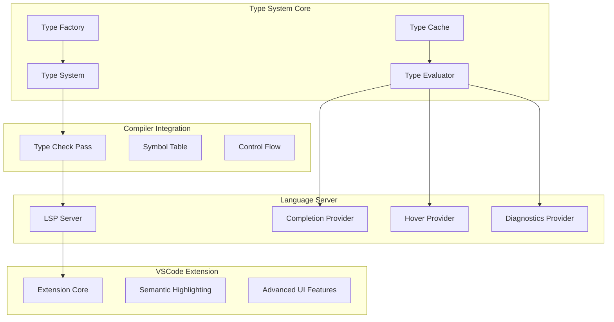

# Jac Type Checker Implementation: Pyright-Inspired Architecture

## Table of Contents
1. [Executive Summary](#executive-summary)
2. [Architecture Overview](#architecture-overview)
3. [Core Type System Design](#core-type-system-design)
4. [Type Evaluator Engine](#type-evaluator-engine)
5. [Language Server Integration](#language-server-integration)
6. [VSCode Extension Enhancement](#vscode-extension-enhancement)
7. [Performance & Caching Strategy](#performance--caching-strategy)
8. [Jac-Specific Features](#jac-specific-features)
9. [Implementation Challenges](#implementation-challenges)
10. [Success Metrics](#success-metrics)

---

## Executive Summary

This document outlines the implementation of a comprehensive type checker for the Jac programming language, inspired by Microsoft's Pyright architecture. The goal is to create a robust, performant type system that provides excellent developer experience through advanced IDE features while respecting Jac's unique graph-based programming model.

### Key Objectives
- **Type Safety**: Implement a sound type system with gradual typing support
- **Performance**: Aggressive caching and incremental analysis for real-time feedback
- **Developer Experience**: Rich IDE features including smart completions, hover info, and diagnostics
- **Jac Integration**: Native support for archetypes, walkers, abilities, and graph traversal
- **Extensibility**: Modular architecture for future language feature additions

---

## Architecture Overview

### Current State Analysis
The existing Jac compiler already has several foundational components:

```
jaclang/compiler/
├── passes/main/          # Compiler passes including symbol tables
├── unitree.py           # AST representation
├── program.py           # JacProgram coordination
└── parser.py            # Lark-based parser

jaclang/langserve/       # Basic language server
├── engine.jac           # JacLangServer implementation
├── server.jac           # LSP protocol handlers
└── utils.jac            # Utility functions
```

### Proposed Architecture



---

## Core Type System Design

### Type Hierarchy (Inspired by Pyright)

```python
# types.py
class Type(ABC):
    """Base type class following Pyright's design"""
    def __init__(self, category: TypeCategory, flags: TypeFlags = TypeFlags.NONE):
        self.category = category
        self.flags = flags
        self.cached_properties = {}
    
    @abstractmethod
    def display_name(self) -> str:
        pass

class TypeCategory(Enum):
    """Type categories following Pyright's taxonomy"""
    UNKNOWN = "Unknown"
    ANY = "Any"
    NONE = "None"
    NEVER = "Never"
    CLASS = "Class"
    FUNCTION = "Function"
    UNION = "Union"
    OBJECT = "Object"
    ARCHETYPE = "Archetype"    # Jac-specific
    WALKER = "Walker"          # Jac-specific
    ABILITY = "Ability"        # Jac-specific
    NODE = "Node"             # Jac-specific
    EDGE = "Edge"             # Jac-specific

class ClassType(Type):
    """Represents Jac archetypes and Python classes"""
    def __init__(self, 
                 name: str,
                 module_name: str,
                 is_archetype: bool = False,
                 type_params: List[TypeVarType] = None):
        super().__init__(TypeCategory.ARCHETYPE if is_archetype else TypeCategory.CLASS)
        self.name = name
        self.module_name = module_name
        self.type_params = type_params or []
        self.mro: List[ClassType] = []
        self.members: Dict[str, Symbol] = {}

class WalkerType(Type):
    """Jac-specific walker type"""
    def __init__(self, name: str, abilities: List[AbilityType]):
        super().__init__(TypeCategory.WALKER)
        self.name = name
        self.abilities = abilities
        self.traversal_patterns: List[TraversalPattern] = []

class AbilityType(Type):
    """Jac-specific ability (method) type"""
    def __init__(self, name: str, signature: FunctionType, target_type: Type = None):
        super().__init__(TypeCategory.ABILITY)
        self.name = name
        self.signature = signature
        self.target_type = target_type  # What archetype this ability targets
```

### Type Factory & Cache System

```python
# type_factory.py
class TypeFactory:
    """Centralized type creation with caching"""
    
    def __init__(self):
        self._type_cache: Dict[str, Type] = {}
        self._builtin_types: Dict[str, Type] = {}
        self._initialize_builtins()
    
    def create_class_type(self, name: str, module: str, 
                         is_archetype: bool = False) -> ClassType:
        """Create or retrieve cached class type"""
        cache_key = f"{module}.{name}:{'arch' if is_archetype else 'class'}"
        if cache_key not in self._type_cache:
            self._type_cache[cache_key] = ClassType(name, module, is_archetype)
        return self._type_cache[cache_key]
    
    def create_union_type(self, types: List[Type]) -> UnionType:
        """Create union type with automatic simplification"""
        simplified = self._simplify_union(types)
        if len(simplified) == 1:
            return simplified[0]
        
        cache_key = f"Union[{','.join(t.display_name() for t in simplified)}]"
        if cache_key not in self._type_cache:
            self._type_cache[cache_key] = UnionType(simplified)
        return self._type_cache[cache_key]

# type_cache.py
class TypeCache:
    """High-performance type caching system"""
    
    def __init__(self):
        self._expression_cache: Dict[str, Type] = {}
        self._symbol_cache: Dict[str, Type] = {}
        self._mro_cache: Dict[str, List[ClassType]] = {}
        
    def get_expression_type(self, expr_id: str, file_version: int) -> Optional[Type]:
        """Get cached type for expression"""
        cache_key = f"{expr_id}:{file_version}"
        return self._expression_cache.get(cache_key)
    
    def cache_expression_type(self, expr_id: str, file_version: int, type_obj: Type):
        """Cache type for expression"""
        cache_key = f"{expr_id}:{file_version}"
        self._expression_cache[cache_key] = type_obj
```

---

## Type Evaluator Engine

The type evaluator is the heart of the system, responsible for determining types of expressions and performing type checking.

### Core Evaluator Design

```python
# type_evaluator.py
class TypeEvaluator:
    """Main type evaluation engine inspired by Pyright's TypeEvaluator"""
    
    def __init__(self, program: JacProgram, 
                 type_factory: TypeFactory,
                 type_cache: TypeCache):
        self.program = program
        self.type_factory = type_factory
        self.type_cache = type_cache
        self.flow_analyzer = FlowAnalyzer(self)
        
    def get_type_of_expression(self, node: uni.Expr, 
                              expected_type: Type = None) -> TypeResult:
        """Main entry point for expression type evaluation"""
        
        # Check cache first
        cached_type = self.type_cache.get_expression_type(
            node.unique_id, node.file_version
        )
        if cached_type:
            return TypeResult(cached_type, is_incomplete=False)
        
        # Evaluate based on node type
        type_result = self._evaluate_expression_type(node, expected_type)
        
        # Cache result
        self.type_cache.cache_expression_type(
            node.unique_id, node.file_version, type_result.type
        )
        
        return type_result
    
    def _evaluate_expression_type(self, node: uni.Expr, 
                                 expected_type: Type = None) -> TypeResult:
        """Internal type evaluation dispatcher"""
        evaluator_map = {
            uni.Name: self._evaluate_name,
            uni.BinaryOp: self._evaluate_binary_op,
            uni.FuncCall: self._evaluate_func_call,
            uni.AttrAccess: self._evaluate_attr_access,
            uni.WalkerSpawn: self._evaluate_walker_spawn,  # Jac-specific
            uni.EdgeRef: self._evaluate_edge_ref,          # Jac-specific
        }
        
        evaluator = evaluator_map.get(type(node))
        if evaluator:
            return evaluator(node, expected_type)
        else:
            return TypeResult(self.type_factory.get_unknown_type())
    
    def _evaluate_walker_spawn(self, node: uni.WalkerSpawn, 
                              expected_type: Type = None) -> TypeResult:
        """Evaluate walker spawn expression (Jac-specific)"""
        walker_type = self.get_type_of_expression(node.walker).type
        
        if not isinstance(walker_type, WalkerType):
            self._add_diagnostic(
                node, 
                f"Expected walker type, got {walker_type.display_name()}"
            )
            return TypeResult(self.type_factory.get_unknown_type())
        
        # Validate spawn arguments against walker constructor
        arg_types = [self.get_type_of_expression(arg).type for arg in node.args]
        self._validate_walker_constructor(walker_type, arg_types, node)
        
        return TypeResult(walker_type)
```

### Flow Analysis Integration

```python
# flow_analyzer.py
class FlowAnalyzer:
    """Control flow-aware type analysis"""
    
    def __init__(self, evaluator: TypeEvaluator):
        self.evaluator = evaluator
        self.flow_nodes: Dict[str, FlowNode] = {}
    
    def analyze_conditional(self, node: uni.IfStmt) -> FlowAnalysisResult:
        """Analyze type refinement in conditional statements"""
        condition_type = self.evaluator.get_type_of_expression(node.condition).type
        
        # Analyze type guards (isinstance, hasattr, etc.)
        true_branch_constraints = self._extract_type_constraints(
            node.condition, is_positive=True
        )
        false_branch_constraints = self._extract_type_constraints(
            node.condition, is_positive=False
        )
        
        # Apply constraints to respective branches
        with self._constraint_context(true_branch_constraints):
            true_types = self._analyze_block(node.if_body)
            
        with self._constraint_context(false_branch_constraints):
            false_types = self._analyze_block(node.else_body) if node.else_body else {}
        
        return FlowAnalysisResult(true_types, false_types)
    
    def _extract_type_constraints(self, condition: uni.Expr, 
                                 is_positive: bool) -> List[TypeConstraint]:
        """Extract type constraints from conditional expressions"""
        constraints = []
        
        if isinstance(condition, uni.FuncCall):
            if (isinstance(condition.func, uni.Name) and 
                condition.func.name == "isinstance"):
                # Handle isinstance() type guards
                target = condition.args[0]
                type_arg = condition.args[1]
                constraint_type = self._resolve_isinstance_type(type_arg)
                
                if is_positive:
                    constraints.append(
                        TypeConstraint(target, constraint_type, ConstraintKind.IS_INSTANCE)
                    )
                else:
                    constraints.append(
                        TypeConstraint(target, constraint_type, ConstraintKind.IS_NOT_INSTANCE)
                    )
        
        return constraints
```

---

## Language Server Integration

### Enhanced LSP Features

The language server will be enhanced with type-aware features:

```python
# Enhanced completion provider
class TypeAwareCompletionProvider:
    """Provides type-aware completions"""
    
    def __init__(self, type_evaluator: TypeEvaluator):
        self.type_evaluator = type_evaluator
    
    def get_completions(self, uri: str, position: Position, 
                       trigger_char: str = None) -> CompletionList:
        """Generate type-aware completions"""
        
        # Parse file and find context
        module = self._get_module(uri)
        node = self._find_node_at_position(module, position)
        
        if isinstance(node, uni.AttrAccess):
            return self._get_attribute_completions(node)
        elif isinstance(node, uni.WalkerSpawn):
            return self._get_walker_completions(node)
        elif trigger_char == ':':
            return self._get_ability_completions(node)
        else:
            return self._get_scope_completions(node)
    
    def _get_attribute_completions(self, node: uni.AttrAccess) -> CompletionList:
        """Get completions for attribute access"""
        obj_type = self.type_evaluator.get_type_of_expression(node.obj).type
        
        completions = []
        if isinstance(obj_type, ClassType):
            for member_name, symbol in obj_type.members.items():
                if not member_name.startswith('_'):  # Hide private members
                    completion = CompletionItem(
                        label=member_name,
                        kind=self._symbol_to_completion_kind(symbol),
                        detail=symbol.type.display_name() if symbol.type else None,
                        documentation=symbol.docstring
                    )
                    completions.append(completion)
        
        return CompletionList(items=completions)

# Enhanced hover provider
class TypeAwareHoverProvider:
    """Provides rich hover information"""
    
    def get_hover(self, uri: str, position: Position) -> Optional[Hover]:
        """Get hover information with type details"""
        
        module = self._get_module(uri)
        node = self._find_node_at_position(module, position)
        
        if not node:
            return None
        
        # Get type information
        type_result = self.type_evaluator.get_type_of_expression(node)
        type_str = type_result.type.display_name()
        
        # Build hover content
        content_parts = [f"```jac\n{type_str}\n```"]
        
        # Add documentation if available
        if hasattr(node, 'symbol') and node.symbol.docstring:
            content_parts.append(node.symbol.docstring)
        
        # Add archetype/walker specific information
        if isinstance(type_result.type, ClassType) and type_result.type.is_archetype:
            content_parts.append(self._get_archetype_info(type_result.type))
        elif isinstance(type_result.type, WalkerType):
            content_parts.append(self._get_walker_info(type_result.type))
        
        return Hover(
            contents=MarkupContent(
                kind=MarkupKind.Markdown,
                value='\n\n'.join(content_parts)
            )
        )
```

### Diagnostic Provider Enhancement

```python
class TypeAwareDiagnosticsProvider:
    """Enhanced diagnostics with type information"""
    
    def get_diagnostics(self, uri: str) -> List[Diagnostic]:
        """Generate type-aware diagnostics"""
        
        diagnostics = []
        module = self._get_module(uri)
        
        # Run type checking pass
        type_check_pass = TypeCheckPass(
            ir_in=module, 
            prog=self.program,
            type_evaluator=self.type_evaluator
        )
        
        # Convert type errors to LSP diagnostics
        for error in type_check_pass.errors_had:
            diagnostic = Diagnostic(
                range=self._loc_to_range(error.loc),
                message=error.msg,
                severity=DiagnosticSeverity.Error,
                source="jac-type-checker",
                code=error.code
            )
            diagnostics.append(diagnostic)
        
        # Add warnings for potential issues
        for warning in type_check_pass.warnings_had:
            diagnostic = Diagnostic(
                range=self._loc_to_range(warning.loc),
                message=warning.msg,
                severity=DiagnosticSeverity.Warning,
                source="jac-type-checker",
                code=warning.code
            )
            diagnostics.append(diagnostic)
        
        return diagnostics
```

---

## VSCode Extension Enhancement

### Semantic Highlighting

```typescript
// semantic-highlighting.ts
export class JacSemanticTokensProvider implements DocumentSemanticTokensProvider {
    private readonly legend: SemanticTokensLegend;
    
    constructor(private typeEvaluator: TypeEvaluatorProxy) {
        this.legend = new SemanticTokensLegend(
            [
                'archetype', 'walker', 'ability', 'node', 'edge',  // Jac-specific
                'class', 'function', 'variable', 'parameter',
                'property', 'method', 'interface', 'enum',
                'type', 'typeParameter', 'generic'
            ],
            [
                'declaration', 'definition', 'readonly', 'static',
                'deprecated', 'abstract', 'async', 'modification',
                'documentation', 'defaultLibrary'
            ]
        );
    }
    
    async provideDocumentSemanticTokens(
        document: TextDocument
    ): Promise<SemanticTokens> {
        const builder = new SemanticTokensBuilder(this.legend);
        
        // Get semantic analysis from language server
        const semanticInfo = await this.typeEvaluator.getSemanticTokens(
            document.uri.toString()
        );
        
        for (const token of semanticInfo.tokens) {
            builder.push(
                new Range(token.line, token.char, token.line, token.char + token.length),
                token.tokenType,
                token.tokenModifiers
            );
        }
        
        return builder.build();
    }
}

// Enhanced features provider
export class JacAdvancedFeaturesProvider {
    
    // Inlay hints for type information
    async provideInlayHints(
        document: TextDocument,
        range: Range
    ): Promise<InlayHint[]> {
        const hints: InlayHint[] = [];
        
        // Get type information from language server
        const typeInfo = await this.getTypeInformation(document.uri, range);
        
        for (const info of typeInfo) {
            if (info.shouldShowHint) {
                hints.push(new InlayHint(
                    info.position,
                    `: ${info.typeName}`,
                    InlayHintKind.Type
                ));
            }
        }
        
        return hints;
    }
    
    // Code lens for walker entry points
    async provideCodeLenses(document: TextDocument): Promise<CodeLens[]> {
        const lenses: CodeLens[] = [];
        
        // Find walker definitions
        const walkers = await this.findWalkers(document.uri);
        
        for (const walker of walkers) {
            lenses.push(new CodeLens(
                walker.range,
                {
                    title: "▶ Run Walker",
                    command: 'jac.runWalker',
                    arguments: [walker.name, document.uri]
                }
            ));
        }
        
        return lenses;
    }
}
```

---

## Performance & Caching Strategy

### Multi-Level Caching

1. **Expression Type Cache**: Cache types for individual expressions
2. **Symbol Type Cache**: Cache resolved symbol types
3. **Module Analysis Cache**: Cache complete module analysis results
4. **MRO Cache**: Cache method resolution order calculations
5. **Incremental Update Cache**: Track dependencies for incremental updates

```python
class PerformanceOptimizedTypeEvaluator(TypeEvaluator):
    """Type evaluator with aggressive performance optimizations"""
    
    def __init__(self, *args, **kwargs):
        super().__init__(*args, **kwargs)
        self.incremental_tracker = IncrementalAnalysisTracker()
        self.parallel_executor = ThreadPoolExecutor(max_workers=4)
    
    async def analyze_module_async(self, module: uni.Module) -> AnalysisResult:
        """Asynchronous module analysis with parallelization"""
        
        # Check if module needs re-analysis
        if not self.incremental_tracker.needs_analysis(module):
            return self.incremental_tracker.get_cached_result(module)
        
        # Analyze dependencies in parallel
        dep_futures = []
        for dep_module in module.dependencies:
            if self.incremental_tracker.needs_analysis(dep_module):
                future = self.parallel_executor.submit(
                    self._analyze_module_sync, dep_module
                )
                dep_futures.append(future)
        
        # Wait for dependencies
        await asyncio.gather(*[
            asyncio.wrap_future(future) for future in dep_futures
        ])
        
        # Analyze current module
        result = self._analyze_module_sync(module)
        self.incremental_tracker.cache_result(module, result)
        
        return result

class IncrementalAnalysisTracker:
    """Tracks file changes for incremental analysis"""
    
    def __init__(self):
        self.file_timestamps: Dict[str, float] = {}
        self.dependency_graph: Dict[str, Set[str]] = {}
        self.analysis_cache: Dict[str, AnalysisResult] = {}
    
    def needs_analysis(self, module: uni.Module) -> bool:
        """Check if module needs re-analysis"""
        current_time = os.path.getmtime(module.loc.mod_path)
        cached_time = self.file_timestamps.get(module.loc.mod_path, 0)
        
        if current_time > cached_time:
            return True
        
        # Check if any dependencies changed
        for dep_path in self.dependency_graph.get(module.loc.mod_path, set()):
            if self.needs_analysis_by_path(dep_path):
                return True
        
        return False
```

---

## Jac-Specific Features

### Archetype Type Checking

```python
class ArchetypeTypeChecker:
    """Handles Jac-specific archetype features"""
    
    def check_archetype_inheritance(self, archetype: ClassType) -> List[TypeDiagnostic]:
        """Check archetype inheritance rules"""
        diagnostics = []
        
        # Check for proper has/can separation
        for member_name, symbol in archetype.members.items():
            if isinstance(symbol.type, AbilityType):
                # Abilities should be in separate impl files
                if not self._is_in_impl_file(symbol.declaration_node):
                    diagnostics.append(TypeDiagnostic(
                        symbol.declaration_node,
                        f"Ability '{member_name}' should be implemented in .impl.jac file",
                        DiagnosticSeverity.Warning
                    ))
        
        return diagnostics
    
    def check_has_variable_constraints(self, archetype: ClassType) -> List[TypeDiagnostic]:
        """Check has variable type constraints"""
        diagnostics = []
        
        for member_name, symbol in archetype.members.items():
            if symbol.is_has_variable:
                # Check for proper type annotations
                if isinstance(symbol.type, UnknownType):
                    diagnostics.append(TypeDiagnostic(
                        symbol.declaration_node,
                        f"Has variable '{member_name}' should have type annotation",
                        DiagnosticSeverity.Error
                    ))
        
        return diagnostics

class WalkerTypeChecker:
    """Handles walker-specific type checking"""
    
    def check_walker_abilities(self, walker: WalkerType) -> List[TypeDiagnostic]:
        """Check walker ability compatibility"""
        diagnostics = []
        
        for ability in walker.abilities:
            # Check if ability targets are compatible with walker traversal
            if ability.target_type:
                if not self._is_traversable_type(ability.target_type):
                    diagnostics.append(TypeDiagnostic(
                        ability.declaration_node,
                        f"Ability targets non-traversable type {ability.target_type.display_name()}",
                        DiagnosticSeverity.Error
                    ))
        
        return diagnostics
    
    def check_traversal_patterns(self, walker: WalkerType) -> List[TypeDiagnostic]:
        """Check walker traversal pattern validity"""
        diagnostics = []
        
        for pattern in walker.traversal_patterns:
            # Validate edge types in pattern
            for edge_constraint in pattern.edge_constraints:
                if not isinstance(edge_constraint.type, (EdgeType, UnionType)):
                    diagnostics.append(TypeDiagnostic(
                        pattern.declaration_node,
                        f"Invalid edge type in traversal pattern: {edge_constraint.type.display_name()}",
                        DiagnosticSeverity.Error
                    ))
        
        return diagnostics
```

### Graph-Aware Type Analysis

```python
class GraphTypeAnalyzer:
    """Analyzes graph-specific type relationships"""
    
    def analyze_edge_connections(self, graph_model: GraphModel) -> List[TypeDiagnostic]:
        """Analyze edge connection validity"""
        diagnostics = []
        
        for edge in graph_model.edges:
            source_type = edge.source_node.type
            target_type = edge.target_node.type
            edge_type = edge.type
            
            # Check if edge type is compatible with node types
            if not self._is_valid_edge_connection(source_type, target_type, edge_type):
                diagnostics.append(TypeDiagnostic(
                    edge.declaration_node,
                    f"Invalid edge connection: {edge_type.display_name()} "
                    f"between {source_type.display_name()} and {target_type.display_name()}",
                    DiagnosticSeverity.Error
                ))
        
        return diagnostics
    
    def infer_walker_path_types(self, walker_expr: uni.WalkerSpawn) -> PathTypeInfo:
        """Infer possible path types for walker traversal"""
        walker_type = self.type_evaluator.get_type_of_expression(walker_expr.walker).type
        
        if not isinstance(walker_type, WalkerType):
            return PathTypeInfo.unknown()
        
        # Analyze possible paths based on walker abilities and graph structure
        possible_paths = []
        for ability in walker_type.abilities:
            if ability.is_traversal_ability:
                path_types = self._analyze_traversal_ability(ability)
                possible_paths.extend(path_types)
        
        return PathTypeInfo(possible_paths)
```

---

## Implementation Challenges

### Challenge 1: Circular Dependencies
**Problem**: Jac allows circular imports and recursive type definitions
**Solution**: 
- Lazy type resolution with forward declarations
- Dependency cycle detection and breaking
- Progressive type refinement across multiple passes

### Challenge 2: Dynamic Traversal Patterns
**Problem**: Walker traversal patterns can be dynamically determined
**Solution**:
- Static analysis of common patterns
- Conservative type estimates for dynamic cases  
- Runtime type validation hooks

### Challenge 3: Python Interoperability
**Problem**: Seamless integration with Python types and libraries
**Solution**:
- Python stub file generation and parsing
- Type bridge between Jac and Python type systems
- Automatic conversion utilities

### Challenge 4: Performance at Scale
**Problem**: Type checking large codebases efficiently
**Solution**:
- Incremental analysis with dependency tracking
- Parallel type checking of independent modules
- Aggressive caching with invalidation strategies

### Challenge 5: IDE Responsiveness
**Problem**: Providing real-time feedback without blocking UI
**Solution**:
- Background analysis with progress reporting
- Streaming results for partial completions
- Timeout mechanisms for expensive operations

---

## Success Metrics

### Quantitative Metrics
- **Type Error Detection Rate**: >95% of actual type errors caught
- **False Positive Rate**: <5% of reported errors are false positives  
- **Performance**: Type checking completes in <500ms for files <1000 LOC
- **Memory Usage**: <200MB for typical workspace (50-100 files)
- **Completion Response Time**: <100ms for autocompletion requests

### Qualitative Metrics
- **Developer Satisfaction**: Survey-based feedback on IDE experience
- **Code Quality**: Reduction in runtime type errors in production
- **Adoption Rate**: Percentage of Jac developers using type annotations
- **Documentation Quality**: Rich hover information and inline docs

### Ecosystem Integration
- **VSCode Marketplace Rating**: Target 4.5+ stars
- **GitHub Issue Reduction**: 50% reduction in type-related bug reports
- **Community Contributions**: Active community engagement and contributions

---

## Conclusion

This comprehensive type checker implementation will position Jac as a modern, type-safe language with excellent tooling support. By following Pyright's proven architecture patterns while adapting them for Jac's unique features, we can deliver a robust, performant type system that enhances developer productivity and code quality.

The modular design ensures that the system can evolve with the language while maintaining backward compatibility and performance. The focus on caching and incremental analysis will provide the responsiveness needed for a great IDE experience, while the Jac-specific features will make the type system truly useful for graph-based programming patterns.
