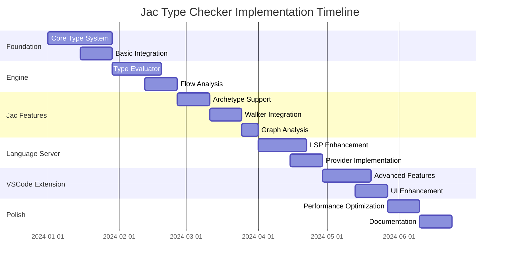

# Jac Type Checker Implementation Plan

## Table of Contents
1. [Project Overview](#project-overview)
2. [Development Phases](#development-phases)
3. [Team Structure & Responsibilities](#team-structure--responsibilities)
4. [Timeline & Milestones](#timeline--milestones)
5. [Commit Strategy](#commit-strategy)
6. [Pull Request Plan](#pull-request-plan)
7. [Feature Development Roadmap](#feature-development-roadmap)
8. [Testing Strategy](#testing-strategy)
9. [Risk Management](#risk-management)
10. [Quality Assurance](#quality-assurance)

---

## Project Overview

### Vision Statement
Implement a comprehensive, Pyright-inspired type checker for Jac that provides world-class developer experience through advanced IDE features while maintaining the language's graph-programming paradigm.

### Key Deliverables
1. **Core Type System** - Object-based type hierarchy with caching
2. **Type Evaluator Engine** - Expression type evaluation with flow analysis  
3. **Compiler Integration** - Type checking passes integrated into compilation pipeline
4. **Enhanced Language Server** - Type-aware LSP features for IDE integration
5. **Advanced VSCode Extension** - Rich semantic highlighting and UI features

### Success Criteria
- Type checking performance: <500ms for 1000 LOC files
- IDE responsiveness: <100ms completion response time
- Type error detection: >95% accuracy with <5% false positives
- Developer adoption: 80% of Jac developers using type annotations within 6 months

---

## Development Phases

### Phase 1: Foundation (Weeks 1-4)
**Goal**: Establish core type system infrastructure

**Core Deliverables**:
- Basic type hierarchy implementation
- Type factory and caching system
- Integration with existing compiler passes
- Unit test framework for type system

**Key Components**:
```
jac/jaclang/compiler/type_system/
├── __init__.py
├── types.py              # Core type classes
├── type_factory.py       # Type creation and caching
├── type_cache.py         # High-performance caching
├── type_utils.py         # Type manipulation utilities
└── tests/
    ├── test_types.py
    ├── test_factory.py
    └── test_cache.py
```

**Acceptance Criteria**:
- [ ] All basic type categories implemented (Unknown, Any, Class, Function, Union)
- [ ] Type factory creates and caches types correctly
- [ ] Cache hit rate >90% for repeated type requests
- [ ] 100% test coverage for type system core
- [ ] Integration tests with existing parser pass

### Phase 2: Type Evaluator Engine (Weeks 5-8)
**Goal**: Implement expression type evaluation and flow analysis

**Core Deliverables**:
- Type evaluator with expression dispatch
- Basic flow analysis for conditionals
- Symbol resolution integration
- Type constraint system

**Key Components**:
```
jac/jaclang/compiler/type_system/
├── evaluator/
│   ├── __init__.py
│   ├── type_evaluator.py    # Main evaluation engine
│   ├── flow_analyzer.py     # Control flow analysis
│   ├── constraint_solver.py # Type constraint resolution
│   └── symbol_resolver.py   # Symbol type resolution
└── passes/
    ├── __init__.py
    └── type_check_pass.py    # Compiler pass integration
```

**Acceptance Criteria**:
- [ ] Basic expression types correctly evaluated (literals, names, binary ops)
- [ ] Function call type checking with argument validation
- [ ] Simple flow analysis for if/else statements
- [ ] Type constraint generation and solving
- [ ] Integration with symbol table passes
- [ ] Performance benchmarks meet targets

### Phase 3: Jac-Specific Features (Weeks 9-12)
**Goal**: Implement Jac language-specific type features

**Core Deliverables**:
- Archetype type checking
- Walker and ability type validation
- Graph traversal pattern analysis
- Edge and node type relationships

**Key Components**:
```
jac/jaclang/compiler/type_system/
├── jac_types/
│   ├── __init__.py
│   ├── archetype_checker.py    # Archetype-specific validation
│   ├── walker_checker.py       # Walker type analysis
│   ├── graph_analyzer.py       # Graph structure analysis
│   └── ability_resolver.py     # Ability type resolution
└── graph/
    ├── __init__.py
    ├── traversal_patterns.py   # Pattern analysis
    └── edge_validation.py      # Edge connection validation
```

**Acceptance Criteria**:
- [ ] Archetype inheritance and member validation
- [ ] Walker spawn and traversal type checking
- [ ] Ability target type validation
- [ ] Graph connectivity analysis
- [ ] Integration with existing Jac compiler passes
- [ ] Comprehensive test suite for Jac features

### Phase 4: Language Server Enhancement (Weeks 13-16)
**Goal**: Enhance LSP with type-aware features

**Core Deliverables**:
- Type-aware autocompletion
- Rich hover information with type details
- Enhanced diagnostics with type error context
- Go-to-definition with type information

**Key Components**:
```
jac/jaclang/langserve/
├── providers/
│   ├── __init__.py
│   ├── completion_provider.py    # Type-aware completions
│   ├── hover_provider.py         # Rich hover information
│   ├── diagnostic_provider.py    # Enhanced diagnostics
│   └── definition_provider.py    # Type-aware navigation
├── type_integration/
│   ├── __init__.py
│   ├── lsp_type_bridge.py       # Bridge to type system
│   └── semantic_analyzer.py     # Semantic token analysis
└── enhanced_engine.jac          # Updated engine with type features
```

**Acceptance Criteria**:
- [ ] Completion accuracy >95% for typed expressions
- [ ] Hover shows detailed type information and documentation
- [ ] Diagnostics include type mismatch details and suggestions
- [ ] Go-to-definition works for all typed symbols
- [ ] LSP performance meets responsiveness targets
- [ ] Integration tests with popular editors

### Phase 5: VSCode Extension Advanced Features (Weeks 17-20)
**Goal**: Implement advanced IDE features in VSCode extension

**Core Deliverables**:
- Semantic highlighting for Jac constructs
- Inlay hints for type information
- Code lens for walker execution
- Advanced debugging features

**Key Components**:
```
jac/support/vscode_ext/jac/src/
├── features/
│   ├── semanticHighlighting.ts   # Advanced syntax highlighting
│   ├── inlayHints.ts            # Type hint overlays
│   ├── codeLens.ts              # Interactive code lenses
│   └── debugSupport.ts          # Enhanced debugging
├── providers/
│   ├── jacCompletionProvider.ts  # Jac-specific completions
│   ├── walkerLauncher.ts        # Walker execution support
│   └── graphVisualizer.ts       # Graph structure visualization
└── ui/
    ├── typeInspector.ts         # Type inspection panel
    └── graphExplorer.ts         # Graph navigation panel
```

**Acceptance Criteria**:
- [ ] Semantic highlighting distinguishes all Jac constructs
- [ ] Inlay hints show types without cluttering code
- [ ] Code lens provides one-click walker execution
- [ ] Graph visualization shows type relationships
- [ ] Extension marketplace rating >4.5 stars
- [ ] Performance meets VSCode extension guidelines

### Phase 6: Performance Optimization & Polish (Weeks 21-24)
**Goal**: Optimize performance and polish user experience

**Core Deliverables**:
- Incremental analysis optimization
- Cache optimization and tuning
- Error message improvement
- Documentation and tutorials

**Key Components**:
```
jac/jaclang/compiler/type_system/
├── optimization/
│   ├── __init__.py
│   ├── incremental_analyzer.py   # Incremental analysis
│   ├── cache_optimizer.py        # Cache performance tuning
│   └── performance_profiler.py   # Performance monitoring
├── diagnostics/
│   ├── __init__.py
│   ├── error_formatter.py        # Enhanced error messages
│   └── suggestion_engine.py      # Type fix suggestions
└── docs/
    ├── type_system_guide.md      # Developer documentation
    ├── performance_guide.md      # Performance best practices
    └── migration_guide.md        # Migration from untyped code
```

**Acceptance Criteria**:
- [ ] Type checking performance targets met consistently
- [ ] Memory usage optimized for large projects
- [ ] Error messages are clear and actionable
- [ ] Comprehensive documentation available
- [ ] Migration tools for existing codebases
- [ ] Beta testing with external developers completed

---

## Team Structure & Responsibilities

### Core Team Roles

**Tech Lead (You)**
- Overall architecture decisions
- Code review and quality standards
- Cross-team coordination
- Performance optimization oversight

**Type System Engineer** 
- Core type hierarchy implementation
- Type evaluator engine development
- Flow analysis algorithms
- Performance optimization

**Compiler Integration Engineer**
- Integration with existing compiler passes
- Symbol table enhancement
- AST node type attribution
- Compiler performance optimization

**Language Server Engineer**
- LSP protocol enhancements
- Provider implementations
- Client-server communication optimization
- Real-time analysis coordination

**Frontend/Extension Engineer**
- VSCode extension development
- UI/UX for type features
- Semantic highlighting implementation
- Developer experience optimization

**QA/Testing Engineer**
- Test framework development
- Performance benchmarking
- Integration testing
- User acceptance testing

### Collaboration Model

**Weekly Cadence**:
- Monday: Sprint planning and architecture review
- Wednesday: Technical deep-dive sessions
- Friday: Demo and retrospective

**Communication Channels**:
- Daily standups (async via Slack)
- Architecture decisions documented in ADRs
- Code reviews via GitHub pull requests
- Design discussions in dedicated channels

---

## Timeline & Milestones

### High-Level Timeline



### Detailed Milestones

**Milestone 1: Foundation Complete (Week 4)**
- Core type system implemented and tested
- Basic compiler integration working
- Performance baseline established
- Demo: Basic type checking for simple expressions

**Milestone 2: Type Evaluator Ready (Week 8)**
- Expression type evaluation complete
- Flow analysis for conditionals working
- Symbol resolution integrated
- Demo: Type checking for complex expressions and functions

**Milestone 3: Jac Integration Complete (Week 12)**
- All Jac-specific features implemented
- Archetype and walker validation working
- Graph analysis operational
- Demo: Full type checking for Jac programs

**Milestone 4: Enhanced LSP Ready (Week 16)**
- Type-aware LSP features implemented
- Performance targets met
- Basic IDE integration complete
- Demo: Rich IDE experience in supported editors

**Milestone 5: Advanced IDE Features (Week 20)**
- VSCode extension with advanced features
- Semantic highlighting and inlay hints
- Interactive features working
- Demo: Professional IDE experience

**Milestone 6: Production Ready (Week 24)**
- Performance optimized
- Documentation complete
- Beta testing successful
- Demo: Ready for public release

---

## Commit Strategy

### Commit Message Format
```
<type>(<scope>): <description>

<body>

<footer>
```

**Types**:
- `feat`: New feature implementation
- `fix`: Bug fix
- `perf`: Performance improvement
- `refactor`: Code refactoring
- `test`: Test addition or modification
- `docs`: Documentation changes
- `style`: Code style changes
- `ci`: CI/CD changes

**Scopes**:
- `types`: Core type system
- `evaluator`: Type evaluator engine
- `compiler`: Compiler integration
- `lsp`: Language server features
- `vscode`: VSCode extension
- `test`: Testing infrastructure
- `perf`: Performance optimization

**Examples**:
```bash
feat(types): implement basic type hierarchy with caching

- Add Type base class with category and flags
- Implement ClassType, FunctionType, UnionType
- Add TypeFactory with creation and caching logic
- Include comprehensive unit tests

Closes #123

fix(evaluator): handle recursive type definitions correctly

- Add cycle detection in type resolution
- Implement lazy type loading for forward references
- Fix infinite recursion in MRO calculation

perf(cache): optimize type cache hit rates

- Implement LRU eviction policy
- Add cache warming for common types
- Reduce memory footprint by 30%
```

### Branch Strategy

**Main Branches**:
- `main`: Production-ready code
- `develop`: Integration branch for features
- `release/v1.0`: Release preparation branch

**Feature Branches**:
- `feature/type-system-core`: Core type system implementation
- `feature/type-evaluator`: Type evaluation engine
- `feature/jac-integration`: Jac-specific features
- `feature/lsp-enhancement`: Language server improvements
- `feature/vscode-advanced`: VSCode extension features

**Hotfix Branches**:
- `hotfix/critical-bug-fix`: Critical bug fixes

### Commit Frequency Guidelines

**Daily Commits**: Minimum one meaningful commit per day
**Feature Branches**: Commit every 2-4 hours during active development
**Integration Points**: Clean up and squash commits before merging
**Documentation**: Update documentation with every public API change

---

## Pull Request Plan

### PR Categories

#### 1. Foundation PRs (Weeks 1-4)

**PR #1: Core Type System Infrastructure**
- **Files**: `types.py`, `type_factory.py`, `type_cache.py`
- **Size**: ~1000 LOC
- **Reviewers**: Tech Lead + Type System Engineer
- **Timeline**: Week 2
- **Tests**: 100% coverage for core classes
- **Breaking Changes**: None (new code)

**PR #2: Compiler Integration Base**
- **Files**: `type_check_pass.py`, `symbol_resolver.py`
- **Size**: ~500 LOC  
- **Reviewers**: Tech Lead + Compiler Integration Engineer
- **Timeline**: Week 3
- **Tests**: Integration tests with existing passes
- **Breaking Changes**: Minor changes to symbol table

**PR #3: Basic Type Evaluation**
- **Files**: `type_evaluator.py`, basic expression handlers
- **Size**: ~800 LOC
- **Reviewers**: Tech Lead + Type System Engineer
- **Timeline**: Week 4
- **Tests**: Expression type evaluation tests
- **Breaking Changes**: None

#### 2. Engine PRs (Weeks 5-8)

**PR #4: Expression Type Evaluation Engine**
- **Files**: Complete `type_evaluator.py`, expression handlers
- **Size**: ~1200 LOC
- **Reviewers**: Tech Lead + 2 engineers
- **Timeline**: Week 6
- **Tests**: Comprehensive expression type tests
- **Breaking Changes**: None

**PR #5: Flow Analysis Implementation**
- **Files**: `flow_analyzer.py`, `constraint_solver.py`
- **Size**: ~900 LOC
- **Reviewers**: Tech Lead + Type System Engineer
- **Timeline**: Week 7
- **Tests**: Flow analysis test suite
- **Breaking Changes**: None

**PR #6: Symbol Resolution Enhancement**
- **Files**: `symbol_resolver.py`, integration updates
- **Size**: ~600 LOC
- **Reviewers**: Tech Lead + Compiler Integration Engineer
- **Timeline**: Week 8
- **Tests**: Symbol resolution integration tests
- **Breaking Changes**: Symbol table API updates

#### 3. Jac Features PRs (Weeks 9-12)

**PR #7: Archetype Type System**
- **Files**: `archetype_checker.py`, archetype types
- **Size**: ~700 LOC
- **Reviewers**: Tech Lead + Domain Expert
- **Timeline**: Week 10
- **Tests**: Archetype validation tests
- **Breaking Changes**: None

**PR #8: Walker and Ability Integration**
- **Files**: `walker_checker.py`, `ability_resolver.py`
- **Size**: ~800 LOC
- **Reviewers**: Tech Lead + Type System Engineer  
- **Timeline**: Week 11
- **Tests**: Walker type checking tests
- **Breaking Changes**: None

**PR #9: Graph Analysis Features**
- **Files**: `graph_analyzer.py`, traversal pattern analysis
- **Size**: ~600 LOC
- **Reviewers**: Tech Lead + Domain Expert
- **Timeline**: Week 12
- **Tests**: Graph analysis test suite
- **Breaking Changes**: None

#### 4. Language Server PRs (Weeks 13-16)

**PR #10: Enhanced Completion Provider**
- **Files**: `completion_provider.py`, type-aware completions
- **Size**: ~800 LOC
- **Reviewers**: Tech Lead + Language Server Engineer
- **Timeline**: Week 14
- **Tests**: Completion accuracy tests
- **Breaking Changes**: LSP API extensions

**PR #11: Rich Hover and Diagnostics**
- **Files**: `hover_provider.py`, `diagnostic_provider.py`
- **Size**: ~600 LOC
- **Reviewers**: Tech Lead + Language Server Engineer
- **Timeline**: Week 15
- **Tests**: Hover and diagnostic tests
- **Breaking Changes**: Minor LSP protocol updates

**PR #12: LSP Integration and Performance**
- **Files**: `lsp_type_bridge.py`, performance optimizations
- **Size**: ~500 LOC
- **Reviewers**: Tech Lead + Performance Expert
- **Timeline**: Week 16
- **Tests**: Performance benchmarks
- **Breaking Changes**: None

#### 5. VSCode Extension PRs (Weeks 17-20)

**PR #13: Semantic Highlighting Foundation**
- **Files**: `semanticHighlighting.ts`, token providers
- **Size**: ~400 LOC
- **Reviewers**: Tech Lead + Frontend Engineer
- **Timeline**: Week 18
- **Tests**: Highlighting accuracy tests
- **Breaking Changes**: None

**PR #14: Advanced IDE Features**
- **Files**: `inlayHints.ts`, `codeLens.ts`, `debugSupport.ts`
- **Size**: ~600 LOC
- **Reviewers**: Tech Lead + Frontend Engineer
- **Timeline**: Week 19
- **Tests**: Feature integration tests
- **Breaking Changes**: None

**PR #15: UI Enhancement and Polish**
- **Files**: UI panels, graph visualization
- **Size**: ~500 LOC
- **Reviewers**: Tech Lead + UX Reviewer
- **Timeline**: Week 20
- **Tests**: UI/UX tests
- **Breaking Changes**: None

### PR Review Guidelines

**Review Criteria**:
1. **Functionality**: Does the code work as intended?
2. **Performance**: Does it meet performance requirements?
3. **Test Coverage**: Is test coverage >90%?
4. **Documentation**: Are public APIs documented?
5. **Code Quality**: Does it follow style guidelines?
6. **Security**: Are there any security implications?

**Review Process**:
1. **Self-Review**: Author reviews own code before submitting
2. **Automated Checks**: CI/CD pipeline runs tests and linting
3. **Peer Review**: At least 2 reviewers for substantial changes
4. **Tech Lead Approval**: Required for architectural changes
5. **Merge**: Squash and merge with clean commit message

**Review Timeline**:
- **Small PRs** (<200 LOC): 24 hours
- **Medium PRs** (200-800 LOC): 48 hours  
- **Large PRs** (>800 LOC): 72 hours
- **Critical PRs**: Same day review required

---

## Feature Development Roadmap

### Detailed Feature Breakdown

#### Core Type System Features

**Week 1: Basic Type Hierarchy**
- [ ] `Type` base class with category and flags
- [ ] `UnknownType`, `AnyType`, `NoneType` implementations
- [ ] `ClassType` with basic member support
- [ ] `FunctionType` with parameter and return types
- [ ] `UnionType` with type simplification

**Week 2: Type Factory & Caching**
- [ ] `TypeFactory` with creation methods
- [ ] Basic type caching with key generation
- [ ] Builtin type initialization
- [ ] Type equality and hashing
- [ ] Memory usage monitoring

**Week 3: Compiler Integration**
- [ ] `TypeCheckPass` integration with compiler pipeline
- [ ] Symbol table enhancement for type information
- [ ] AST node type attribution
- [ ] Error reporting integration
- [ ] Basic performance benchmarking

**Week 4: Testing & Documentation**
- [ ] Comprehensive unit test suite
- [ ] Integration tests with existing compiler
- [ ] Performance baseline establishment
- [ ] API documentation
- [ ] Developer guide creation

#### Type Evaluator Features

**Week 5: Expression Evaluation Foundation**
- [ ] `TypeEvaluator` main class structure
- [ ] Expression dispatcher with node type mapping
- [ ] Literal expression type evaluation
- [ ] Name (identifier) resolution
- [ ] Basic binary operation type checking

**Week 6: Advanced Expression Evaluation**
- [ ] Function call type checking with overloads
- [ ] Attribute access type resolution
- [ ] List/dict comprehension type inference
- [ ] Lambda expression type evaluation
- [ ] Error accumulation and reporting

**Week 7: Flow Analysis**
- [ ] `FlowAnalyzer` implementation
- [ ] Control flow graph construction
- [ ] Type guard recognition (isinstance, hasattr)
- [ ] Conditional type refinement
- [ ] Loop invariant analysis

**Week 8: Constraint System**
- [ ] Type constraint generation
- [ ] Constraint solver implementation
- [ ] Generic type parameter inference
- [ ] Bidirectional type checking
- [ ] Error recovery strategies

#### Jac-Specific Features

**Week 9: Archetype Foundation**
- [ ] `ArchetypeType` class implementation
- [ ] Has/can member separation
- [ ] Inheritance validation
- [ ] Abstract ability checking
- [ ] Archetype instantiation rules

**Week 10: Advanced Archetype Features**
- [ ] Multiple inheritance validation
- [ ] Method resolution order for archetypes
- [ ] Has variable type constraints
- [ ] Postinit method validation
- [ ] Archetype composition analysis

**Week 11: Walker System**
- [ ] `WalkerType` implementation
- [ ] Ability target type validation
- [ ] Walker spawn type checking
- [ ] Traversal pattern analysis
- [ ] Walker lifecycle validation

**Week 12: Graph Analysis**
- [ ] Node and edge type relationships
- [ ] Graph connectivity validation
- [ ] Path type inference
- [ ] Traversal constraint checking
- [ ] Graph mutation analysis

#### Language Server Enhancement

**Week 13: Completion Provider**
- [ ] Type-aware completion generation
- [ ] Member completion for archetypes/classes
- [ ] Walker ability completion
- [ ] Import statement completion
- [ ] Completion ranking and filtering

**Week 14: Advanced Completions**
- [ ] Context-aware completions
- [ ] Generic type parameter completion
- [ ] Graph traversal pattern completion
- [ ] Auto-import suggestions
- [ ] Completion documentation

**Week 15: Hover & Diagnostics**
- [ ] Rich hover information with types
- [ ] Error message enhancement
- [ ] Warning detection and reporting
- [ ] Quick fix suggestions
- [ ] Diagnostic severity levels

**Week 16: Navigation & Performance**
- [ ] Go-to-definition with type context
- [ ] Find references enhancement
- [ ] Symbol outline with types
- [ ] LSP response time optimization
- [ ] Memory usage optimization

#### VSCode Extension Features

**Week 17: Semantic Highlighting**
- [ ] Token classification for Jac constructs
- [ ] Archetype/walker highlighting
- [ ] Ability highlighting
- [ ] Type annotation highlighting
- [ ] Error/warning highlighting

**Week 18: Advanced Highlighting**
- [ ] Context-dependent highlighting
- [ ] Generic type parameter highlighting
- [ ] Graph element highlighting
- [ ] Unused code highlighting
- [ ] Deprecated feature highlighting

**Week 19: Interactive Features**
- [ ] Inlay hints for type information
- [ ] Code lens for walker execution
- [ ] Interactive type inspection
- [ ] Graph visualization basics
- [ ] Debug support enhancement

**Week 20: UI Polish**
- [ ] Type inspector panel
- [ ] Graph explorer panel
- [ ] Performance monitoring panel
- [ ] Extension settings UI
- [ ] User experience refinement

#### Performance & Polish

**Week 21: Performance Optimization**
- [ ] Incremental analysis implementation
- [ ] Cache optimization and tuning
- [ ] Memory footprint reduction
- [ ] Parallel analysis implementation
- [ ] Performance monitoring dashboard

**Week 22: Advanced Optimization**
- [ ] Lazy type loading
- [ ] Type cache eviction policies
- [ ] Background analysis optimization
- [ ] Memory leak detection and fixing
- [ ] Performance regression tests

**Week 23: Error Message Enhancement**
- [ ] Contextual error messages
- [ ] Error message templates
- [ ] Quick fix suggestions
- [ ] Error categorization
- [ ] Help system integration

**Week 24: Documentation & Release**
- [ ] Comprehensive user documentation
- [ ] Migration guide for existing code
- [ ] Performance tuning guide
- [ ] API reference documentation
- [ ] Release preparation and testing

---

## Testing Strategy

### Test Categories

#### 1. Unit Tests (Target: 95% Coverage)

**Type System Tests**:
```python
# tests/test_types.py
class TestTypeHierarchy:
    def test_type_equality(self):
        """Test type equality and hashing"""
        
    def test_union_type_simplification(self):
        """Test union type automatic simplification"""
        
    def test_generic_type_instantiation(self):
        """Test generic type parameter binding"""

# tests/test_type_factory.py  
class TestTypeFactory:
    def test_type_caching(self):
        """Test type creation and caching"""
        
    def test_builtin_types(self):
        """Test builtin type availability"""
```

**Type Evaluator Tests**:
```python
# tests/test_evaluator.py
class TestTypeEvaluator:
    def test_expression_evaluation(self):
        """Test basic expression type evaluation"""
        
    def test_function_call_checking(self):
        """Test function call type validation"""
        
    def test_flow_analysis(self):
        """Test control flow type refinement"""
```

#### 2. Integration Tests

**Compiler Integration**:
```python
# tests/integration/test_compiler_integration.py
class TestCompilerIntegration:
    def test_type_check_pass_integration(self):
        """Test type checking pass in compiler pipeline"""
        
    def test_symbol_table_integration(self):
        """Test symbol table enhancement"""
        
    def test_error_reporting_integration(self):
        """Test error reporting through compiler"""
```

**Language Server Integration**:
```python
# tests/integration/test_lsp_integration.py
class TestLSPIntegration:
    def test_completion_accuracy(self):
        """Test completion provider accuracy"""
        
    def test_hover_information(self):
        """Test hover information quality"""
        
    def test_diagnostic_reporting(self):
        """Test diagnostic accuracy and performance"""
```

#### 3. Performance Tests

**Benchmarking Framework**:
```python
# tests/performance/test_performance.py
class TestPerformance:
    def test_type_evaluation_performance(self):
        """Benchmark type evaluation speed"""
        assert type_evaluation_time < 500  # ms for 1000 LOC
        
    def test_cache_hit_rates(self):
        """Test cache effectiveness"""
        assert cache_hit_rate > 0.9
        
    def test_memory_usage(self):
        """Test memory consumption"""
        assert memory_usage < 200  # MB for typical workspace
```

#### 4. End-to-End Tests

**Real-World Scenarios**:
```python
# tests/e2e/test_scenarios.py
class TestRealWorldScenarios:
    def test_large_jac_project(self):
        """Test performance on large Jac project"""
        
    def test_complex_archetype_hierarchy(self):
        """Test complex inheritance scenarios"""
        
    def test_graph_traversal_patterns(self):
        """Test complex walker patterns"""
```

### Test Infrastructure

**Automated Testing Pipeline**:
```yaml
# .github/workflows/test.yml
name: Type Checker Tests
on: [push, pull_request]

jobs:
  unit-tests:
    runs-on: ubuntu-latest
    steps:
      - uses: actions/checkout@v3
      - name: Setup Python
        uses: actions/setup-python@v3
        with:
          python-version: '3.11'
      - name: Install dependencies
        run: pip install -r requirements-test.txt
      - name: Run unit tests
        run: pytest tests/unit/ --cov=jaclang.compiler.type_system
      - name: Upload coverage
        uses: codecov/codecov-action@v3

  integration-tests:
    runs-on: ubuntu-latest
    steps:
      - name: Run integration tests
        run: pytest tests/integration/ --timeout=300

  performance-tests:
    runs-on: ubuntu-latest
    steps:
      - name: Run performance benchmarks
        run: pytest tests/performance/ --benchmark-only
```

**Test Data Management**:
```
tests/
├── fixtures/
│   ├── jac_programs/          # Sample Jac programs for testing
│   ├── type_scenarios/        # Specific type checking scenarios
│   └── performance/           # Performance test data
├── utils/
│   ├── test_helpers.py        # Common test utilities
│   ├── assertion_helpers.py   # Custom assertions
│   └── mock_factories.py      # Mock object factories
└── config/
    ├── pytest.ini            # Pytest configuration
    └── coverage.ini           # Coverage configuration
```

### Testing Best Practices

1. **Test-Driven Development**: Write tests before implementation
2. **Comprehensive Coverage**: Aim for >95% code coverage
3. **Performance Regression**: Automated performance testing
4. **Real-World Testing**: Test with actual Jac projects
5. **Continuous Integration**: All tests run on every PR
6. **Manual Testing**: Regular manual testing of IDE features

---

## Risk Management

### Technical Risks

#### Risk 1: Performance Degradation
**Probability**: Medium | **Impact**: High
**Description**: Type checking might slow down compilation significantly
**Mitigation**:
- Implement aggressive caching from day 1
- Set performance budgets and monitor continuously
- Use incremental analysis to minimize work
- Parallel processing for independent modules

**Contingency**: If performance targets not met, implement opt-in type checking mode

#### Risk 2: Complex Type Inference
**Probability**: High | **Impact**: Medium
**Description**: Jac's dynamic features may make type inference very complex
**Mitigation**:
- Start with simple inference and gradually add complexity
- Use conservative estimates for unclear cases
- Provide explicit type annotation escape hatches
- Document limitations clearly

**Contingency**: Fall back to explicit typing requirements for complex cases

#### Risk 3: Integration Complexity
**Probability**: Medium | **Impact**: High
**Description**: Integration with existing compiler may require significant refactoring
**Mitigation**:
- Design type system as additive to existing infrastructure
- Use adapter patterns for compatibility
- Implement feature flags for gradual rollout
- Maintain backward compatibility

**Contingency**: Implement as optional analysis pass that can be disabled

### Project Risks

#### Risk 4: Resource Constraints
**Probability**: Medium | **Impact**: Medium
**Description**: Team members may be unavailable or reassigned
**Mitigation**:
- Cross-train team members on multiple components
- Document architectural decisions thoroughly
- Use pair programming for knowledge sharing
- Maintain detailed implementation guides

**Contingency**: Adjust scope and timeline based on available resources

#### Risk 5: Scope Creep
**Probability**: High | **Impact**: Medium
**Description**: Additional features may be requested during implementation
**Mitigation**:
- Define clear scope boundaries and success criteria
- Use change control process for scope modifications
- Prioritize features using user impact analysis
- Communicate trade-offs clearly

**Contingency**: Defer non-essential features to future releases

### Quality Risks

#### Risk 6: False Positives/Negatives
**Probability**: Medium | **Impact**: High
**Description**: Type checker may report incorrect errors or miss real issues
**Mitigation**:
- Extensive testing with real-world code
- Beta testing with external developers
- Feedback collection and rapid iteration
- Conservative type checking approach initially

**Contingency**: Implement confidence levels and warning categories

### Risk Monitoring

**Weekly Risk Assessment**:
- Review risk probability and impact
- Update mitigation strategies
- Identify new risks
- Communicate status to stakeholders

**Risk Indicators**:
- Performance benchmark failures
- Test failure rates increasing
- Team velocity declining
- User feedback quality decreasing

---

## Quality Assurance

### Code Quality Standards

#### Code Style Guidelines
- **Python**: Follow PEP 8 with line length 100 characters
- **TypeScript**: Use Prettier with standard configuration
- **Jac**: Follow existing Jac style conventions
- **Documentation**: All public APIs must have docstrings

#### Code Review Checklist
- [ ] Functionality works as intended
- [ ] Performance requirements met
- [ ] Test coverage >90%
- [ ] No security vulnerabilities
- [ ] Documentation updated
- [ ] Error handling implemented
- [ ] Logging added where appropriate
- [ ] Memory leaks addressed

### Automated Quality Checks

```yaml
# Quality Gates in CI/CD
quality_gates:
  - code_coverage: ">90%"
  - performance_regression: "0%"
  - security_scan: "no_high_vulnerabilities"
  - linting: "zero_errors"
  - type_checking: "strict_mode_passes"
  - documentation: "api_docs_complete"
```

### Manual Testing Protocol

#### Weekly Manual Testing
1. **Functionality Testing**: Test all major features manually
2. **Performance Testing**: Monitor response times and memory usage
3. **Usability Testing**: Test developer experience with IDE features
4. **Integration Testing**: Test with various Jac projects
5. **Regression Testing**: Verify previous bugs don't reoccur

#### Release Testing Protocol
1. **Feature Complete Testing**: All planned features working
2. **Performance Acceptance**: All performance targets met
3. **Documentation Review**: All documentation accurate and complete
4. **Beta User Testing**: External developers test and provide feedback
5. **Backwards Compatibility**: Existing Jac code still works

### Quality Metrics Tracking

**Development Metrics**:
- Code coverage percentage
- Test pass/fail rates
- Performance benchmark results
- Static analysis violation counts
- Code review approval times

**User Experience Metrics**:
- IDE response times
- Error message clarity ratings
- Feature adoption rates
- User satisfaction scores
- Bug report frequency

**Release Quality Metrics**:
- Critical bugs post-release
- Performance in production
- User adoption rates
- Community feedback sentiment
- Support ticket volume

---

## Conclusion

This comprehensive implementation plan provides a structured approach to building a world-class type checker for Jac. The phased approach allows for iterative development with continuous feedback and course correction. The emphasis on testing, performance, and quality assurance ensures that the final product will meet the high standards expected by modern developers.

The plan balances ambitious technical goals with practical implementation considerations, providing multiple contingency options for managing risks. Regular milestones and clear success criteria enable effective project management and stakeholder communication.

Success of this project will significantly enhance Jac's position as a modern, type-safe programming language with excellent tooling support, attracting more developers to the language and improving productivity for existing users.
