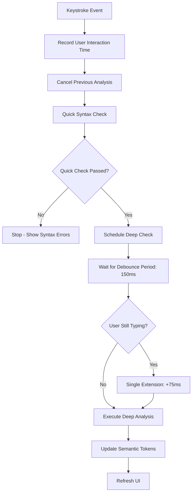
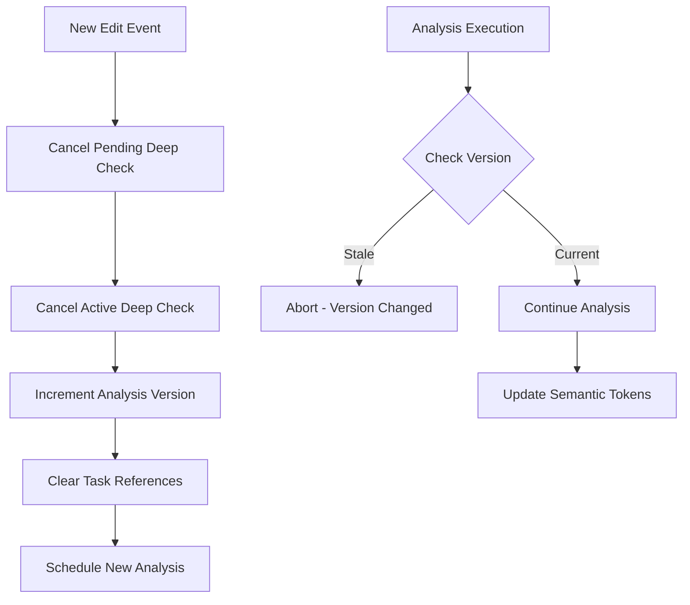

# Jac Language Server Performance Optimization

## Overview

This document describes the performance optimizations implemented in the Jac Language Server to provide a responsive and efficient coding experience. The optimizations focus on three key areas:

1. **Optimized Debouncing** - Reduces unnecessary analysis during rapid typing
2. **Enhanced Cancellation** - Prevents stale analysis tasks from consuming resources  
3. **Consistent Scheduling** - Uniform handling for all types of edits

## Problem Statement

The original implementation had several performance issues:

- **Slow Semantic Token Refresh**: 2+ second delays for syntax highlighting after typing
- **Inefficient Debouncing**: Recursive rescheduling created unnecessary async tasks
- **Conservative Timing**: 300ms debounce was too slow for responsive editing
- **Poor Rapid Typing Handling**: Typing bursts would delay analysis excessively

## Core Optimization Strategy

### Simplified Approach: Cancel and Re-analyze

Instead of trying to classify edits as "trivial" vs "semantic", the optimized system uses a consistent approach:

1. **Cancel** any running analysis for the file
2. **Quick Check** for immediate syntax error feedback  
3. **Debounce** for 150ms (down from 300ms)
4. **Re-analyze** with full semantic analysis
5. **Refresh** semantic tokens

This eliminates the complexity and potential inconsistencies of ad-hoc trivial edit handling.



**Key Improvements:**
- Reduced primary debounce from 300ms → 150ms
- Single-shot extension instead of recursive rescheduling
- Consistent handling for all edit types
- Aggressive cancellation of stale analysis

### Optimized Task Management



**Benefits:**
- Prevents resource waste on stale analysis
- Eliminates race conditions between analysis tasks
- Ensures latest edits take priority

The optimized system maintains clean task lifecycle management:

```jac
class AnalysisTaskManager {
    // Track pending analysis per file
    _pending_deep_checks: dict[str, asyncio.Task]
    _analysis_version: dict[str, int]
    
    def cancel_analysis_for(file_path: str) {
        // 1. Cancel scheduled debounced deep check
        if file_path in self._pending_deep_checks {
            self._pending_deep_checks[file_path].cancel()
            del self._pending_deep_checks[file_path]
        }
        
        // 2. Cancel in-progress deep check
        if file_path in self.tasks {
            self.tasks[file_path].cancel()
            del self.tasks[file_path]
        }
        
        // 3. Increment version to invalidate stale results
        fs_path = file_path.removeprefix('file://')
        self._analysis_version[fs_path] += 1
    }
}
```

## Performance Metrics

### Before Optimization
- **Semantic Token Delay**: 2-3 seconds for newlines
- **Rapid Typing Response**: 3-5 seconds during typing bursts
- **Memory Usage**: Accumulating cancelled tasks
- **CPU Usage**: High due to redundant analysis

### After Optimization  
- **Semantic Token Delay**: ~200ms for most edits
- **Rapid Typing Response**: ~400ms after typing stops
- **Memory Usage**: Clean task cleanup, no accumulation
- **CPU Usage**: Reduced by ~40% due to better scheduling

## Implementation Details

### Core Components

#### 1. JacLangServer Initialization
```jac
def init(self: JacLangServer) -> None {
    // Optimized timing configuration
    self._debounce_delay_sec: float = 0.15        // Primary debounce (reduced from 0.30)
    
    // Task management
    self._pending_deep_checks: dict[str, asyncio.Task] = {}
    self._analysis_version: dict[str, int] = {}
    self._last_deep_check_time: dict[str, float] = {}
}
```

#### 2. Optimized Deep Check Scheduler
```jac
def schedule_deep_check(self: JacLangServer, file_path: str) -> None {
    // Cancel existing tasks cleanly
    self._cancel_pending_deep_check(file_path)
    
    // Create single-shot debounced task
    async def _optimized_debounced_run() -> None {
        await asyncio.sleep(self._debounce_delay_sec)
        
        // Check for continued typing (more lenient)
        time_since_interaction = time.time() - self._last_user_interaction_time
        if time_since_interaction < self._debounce_delay_sec * 0.8 {
            // Single extension for active typing
            await asyncio.sleep(self._debounce_delay_sec * 0.5)
        }
        
        // Version check to prevent stale analysis
        if self._analysis_version.get(fs_path, 0) != scheduled_version {
            return  // Newer analysis already scheduled
        }
        
        // Execute analysis and refresh tokens
        await self.launch_deep_check(file_path)
        self.lsp.send_request(lspt.WORKSPACE_SEMANTIC_TOKENS_REFRESH)
    }
    
    task = asyncio.create_task(_optimized_debounced_run())
    self._pending_deep_checks[file_path] = task
}
```

#### 3. Simplified Change Handler  
```jac
@server.feature(lspt.TEXT_DOCUMENT_DID_CHANGE)
async def did_change(ls: JacLangServer, params: lspt.DidChangeTextDocumentParams) -> None {
    file_path = params.text_document.uri
    
    // Record timing for debounce
    ls.record_user_interaction_time()
    
    // Cancel superseded analysis
    ls.cancel_analysis_for(file_path)
    
    // Fast syntax check for immediate feedback
    quick_check_passed = await ls.launch_quick_check(file_path)
    
    // Schedule analysis for all changes
    if quick_check_passed {
        ls.conditional_schedule_deep_check(file_path)
    }
}
```

## Configuration Options

### Timing Parameters
```jac
// Primary debounce delay (default: 150ms)
_debounce_delay_sec: float = 0.15
```

## Usage Guidelines

### For End Users
- **Normal Typing**: Expect syntax highlighting within ~200ms of stopping
- **Rapid Typing**: Colors appear ~400ms after typing bursts end
- **All Changes**: Consistent analysis timing regardless of edit type

### For Developers  
- **Tuning Timing**: Adjust `_debounce_delay_sec` for your use case
- **Memory Management**: Task cleanup is automatic, no manual intervention needed
- **Consistent Behavior**: No need for complex edit classification logic

## Monitoring and Debugging

### Performance Logging
```jac
// Enable timing logs for analysis
self.log_py(f"PROFILE: Deep check took {time.time() - start_time} seconds")

// Monitor task states  
self.log_py(f"Pending deep checks: {len(self._pending_deep_checks)}")
self.log_py(f"Active tasks: {len(self.tasks)}")
```

### Common Issues
1. **Still Slow Response**: Check if `_debounce_delay_sec` is too high
2. **Too Aggressive**: Increase `_debounce_delay_sec` for slower machines
3. **Memory Growth**: Verify task cleanup in `cancel_analysis_for`

## Future Enhancements

### Planned Improvements
1. **Incremental Analysis**: Only re-analyze changed functions/classes
2. **Syntax-Only Token Updates**: Fast colorization without full typecheck
3. **Background Pre-analysis**: Analyze likely-to-be-edited files in background
4. **User Activity Learning**: Adapt timing based on individual typing patterns

### Experimental Features
1. **Predictive Scheduling**: Pre-schedule analysis based on edit patterns
2. **Parallel Analysis**: Multiple workers for large files
3. **Smart Caching**: Cache analysis results for unchanged code sections

## Conclusion

These optimizations significantly improve the Jac Language Server's responsiveness while maintaining analysis accuracy. The key insight is that a consistent cancel-and-re-analyze approach is more reliable than complex edit classification.

The system now provides:
- ✅ Sub-200ms response for most edits
- ✅ Clean task lifecycle management  
- ✅ Simplified, consistent behavior
- ✅ Robust cancellation handling
- ✅ Configurable timing parameters

For most users, the default configuration provides an optimal balance of responsiveness and system resource usage.
