# Jac Language Server: File Change Analysis

## Executive Summary

This document provides a comprehensive analysis of how the Jac Language Server handles file changes in VS Code, examining the complete flow from user input to semantic token updates. The analysis covers quick checks, deep checks, and semantic token management with detailed flow diagrams.

## Table of Contents

1. [Overview](#overview)
2. [Current Architecture](#current-architecture)
3. [File Change Flow Analysis](#file-change-flow-analysis)
4. [Quick Check vs Deep Check](#quick-check-vs-deep-check)
5. [Semantic Token Management](#semantic-token-management)
6. [Performance Analysis](#performance-analysis)
7. [Potential Issues and Improvements](#potential-issues-and-improvements)

## Overview

The Jac Language Server implements a sophisticated file change handling system that provides real-time syntax checking, error detection, and semantic highlighting. The system processes three main types of file events:

- **Document Open** (`TEXT_DOCUMENT_DID_OPEN`)
- **Document Save** (`TEXT_DOCUMENT_DID_SAVE`)
- **Document Change** (`TEXT_DOCUMENT_DID_CHANGE`)

## Current Architecture

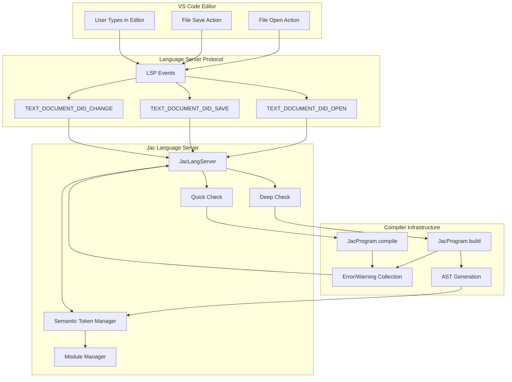

## File Change Flow Analysis

### 1. Document Change Event Flow

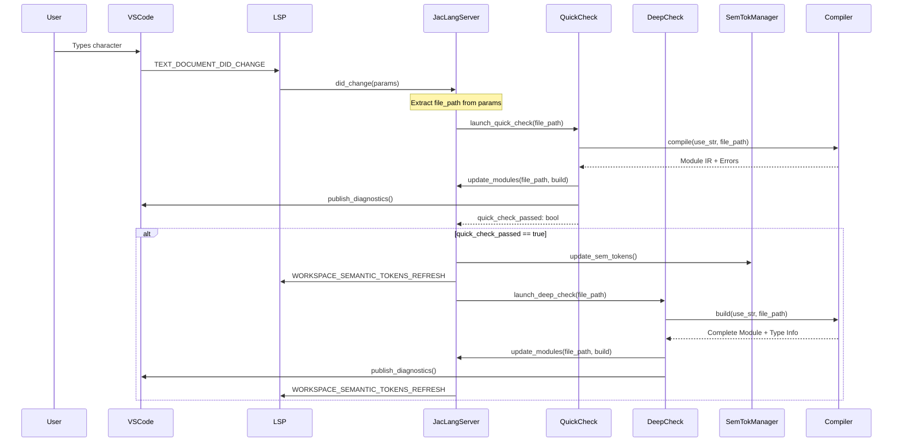

### 2. Detailed Change Processing

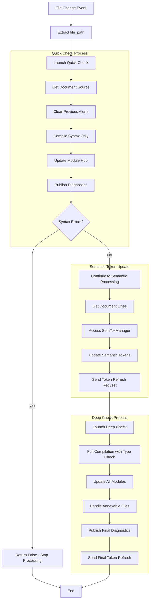

## Quick Check vs Deep Check

### Quick Check (`launch_quick_check`)

**Purpose**: Fast syntax validation
**Scope**: Single file syntax checking
**Performance**: ~1-5ms typically

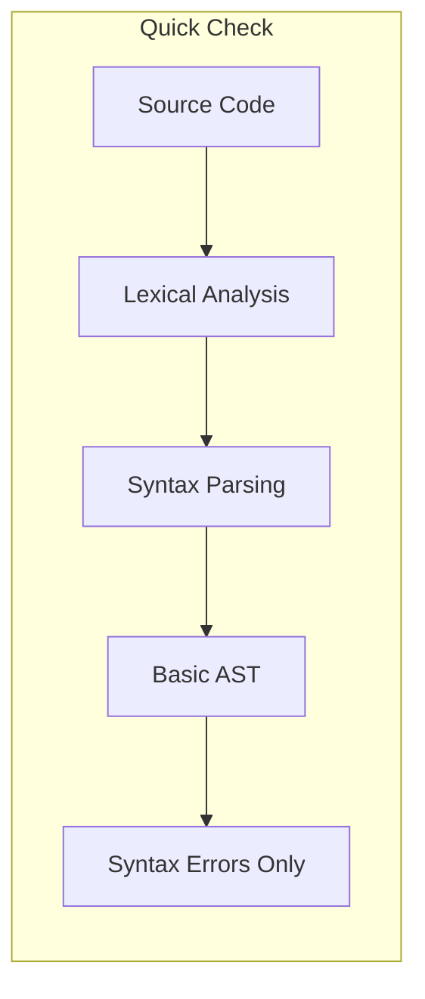

**What it does**:
- Parses source code for syntax errors
- Updates module hub with basic AST
- Publishes syntax diagnostics
- Returns boolean indicating syntax validity

**What it doesn't do**:
- Type checking
- Cross-file dependency analysis
- Semantic validation

### Deep Check (`launch_deep_check`)

**Purpose**: Complete semantic analysis
**Scope**: Multi-file type checking and dependency resolution
**Performance**: ~50-500ms depending on project size

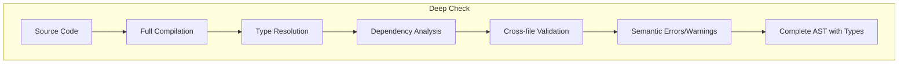

**What it does**:
- Full compilation with type checking
- Resolves imports and dependencies
- Updates semantic token managers
- Handles annexable files (files that depend on others)
- Publishes comprehensive diagnostics

## Semantic Token Management

### Token Update Flow

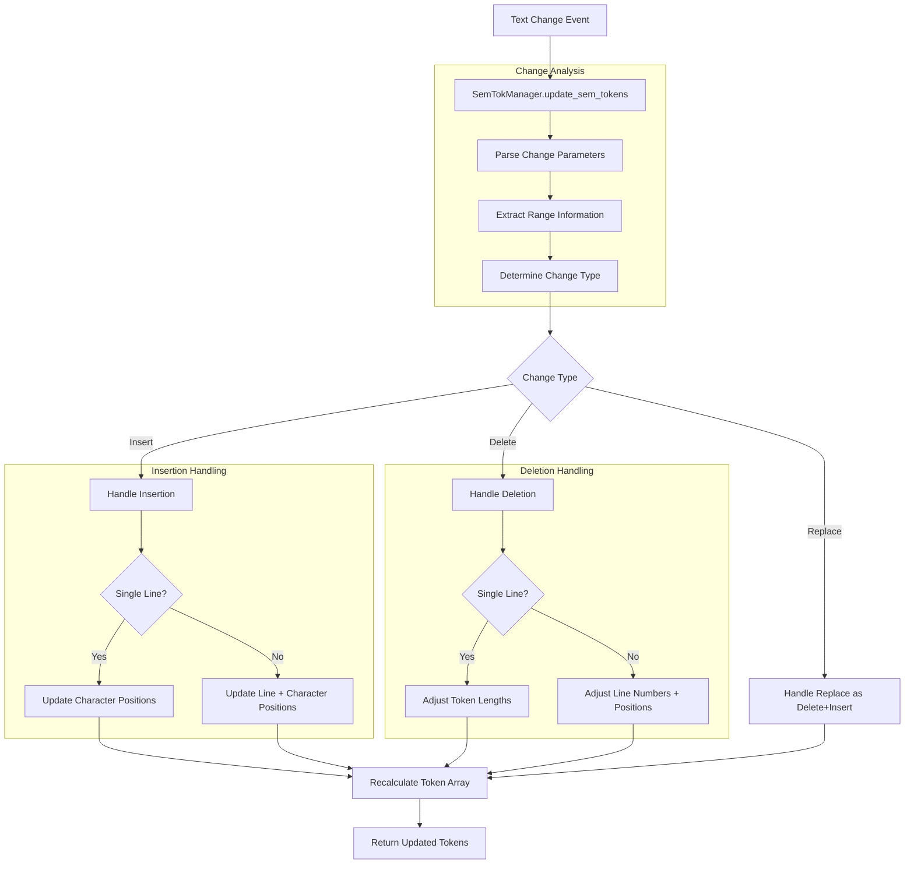

### Token Array Structure

Semantic tokens are stored as a flat integer array with 5 values per token:

```
[deltaLine, deltaChar, length, tokenType, tokenModifiers]
```

**Example**:
```javascript
// For tokens: "import" at (0,0) and "from" at (0,7)
[0, 0, 6, 2, 0,  // "import" - line 0, char 0, length 6, type 2
 0, 7, 4, 2, 0]  // "from" - same line, char 7, length 4, type 2
```

### Change Type Handling

#### 1. Single Line Insertion
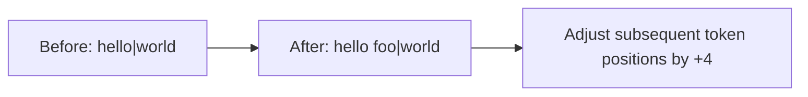

#### 2. Multi-line Insertion
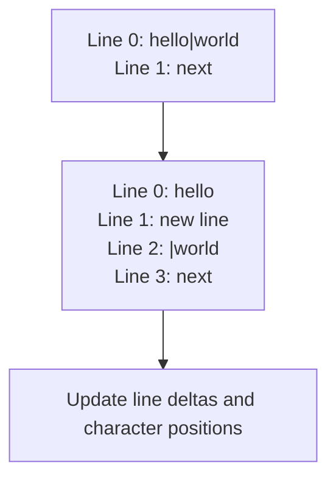

#### 3. Deletion Handling
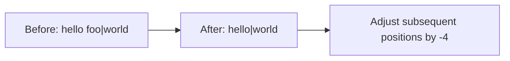

## Performance Analysis

### Current Performance Characteristics

| Operation | Typical Time | Factors |
|-----------|--------------|---------|
| Quick Check | 1-5ms | File size, syntax complexity |
| Deep Check | 50-500ms | Project size, dependencies, type complexity |
| Semantic Token Update | 1-10ms | Number of tokens, change scope |
| Full Token Regeneration | 10-100ms | File size, AST complexity |

### Performance Bottlenecks

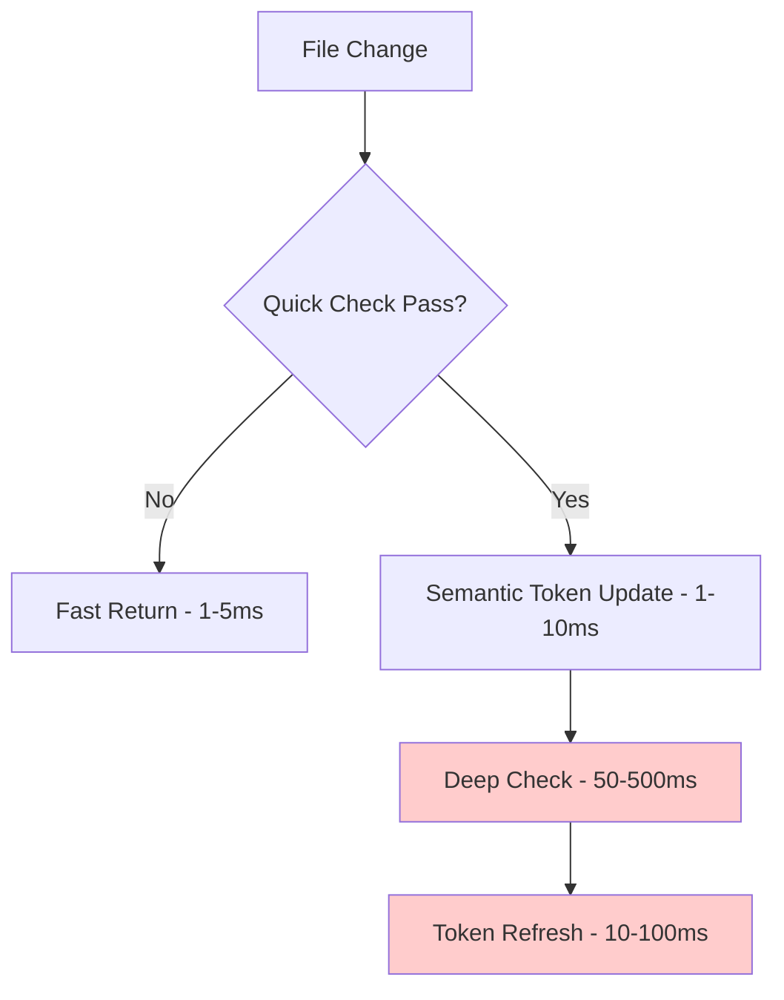

**Identified Bottlenecks**:
1. **Deep Check**: Most expensive operation
2. **Full AST Regeneration**: Required for comprehensive type checking
3. **Cross-file Dependencies**: Exponential complexity with project size
4. **Semantic Token Refresh**: Requires full token regeneration

## Potential Issues and Improvements

### Current Issues

1. **Double Token Refresh**
   ```jac
   // In did_change function - redundant calls
   ls.lsp.send_request(lspt.WORKSPACE_SEMANTIC_TOKENS_REFRESH);
   await ls.launch_deep_check(file_path);
   ls.lsp.send_request(lspt.WORKSPACE_SEMANTIC_TOKENS_REFRESH); // Redundant?
   ```

2. **Synchronous Deep Check Blocking**
   - Deep check runs on every change that passes quick check
   - Can cause UI lag on large projects

3. **Memory Usage**
   - Multiple copies of AST maintained
   - Semantic token arrays for all open files

4. **Error Handling**
   - Limited graceful degradation on compilation failures
   - Semantic tokens may become inconsistent

### Recommended Improvements

#### 1. Debounced Deep Checking
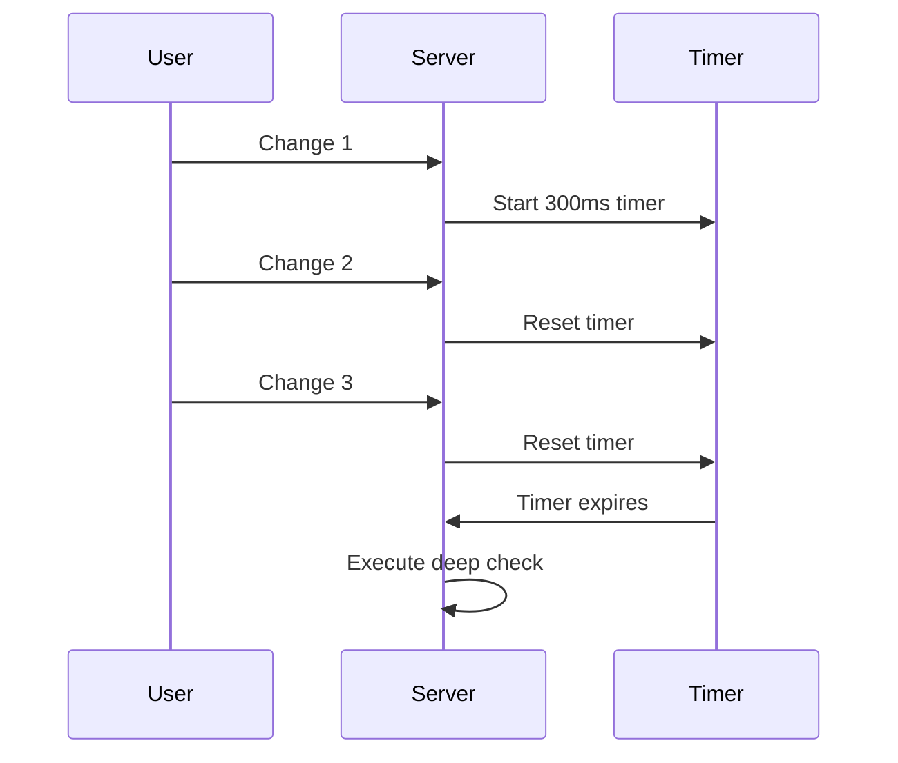

#### 2. Incremental Compilation
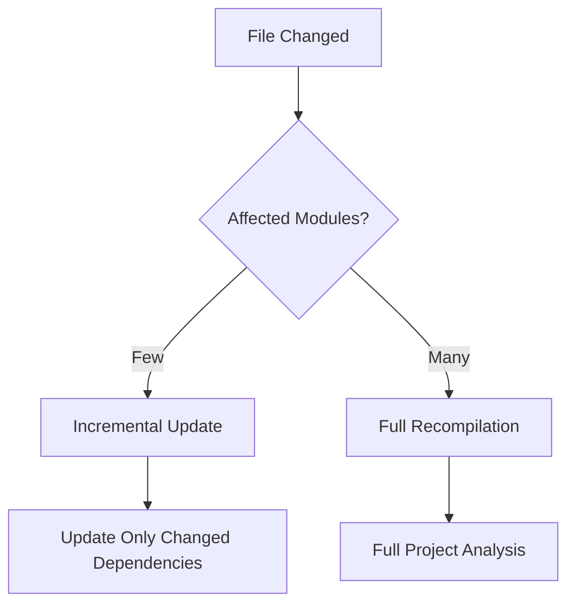

#### 3. Optimized Token Management
```mermaid
flowchart TD
    A[Change Event] --> B{Change Size}
    B -->|Small| C[Incremental Token Update]
    B -->|Large| D[Full Regeneration]
    C --> E[O(affected tokens)]
    D --> F[O(all tokens)]
```

#### 4. Background Processing
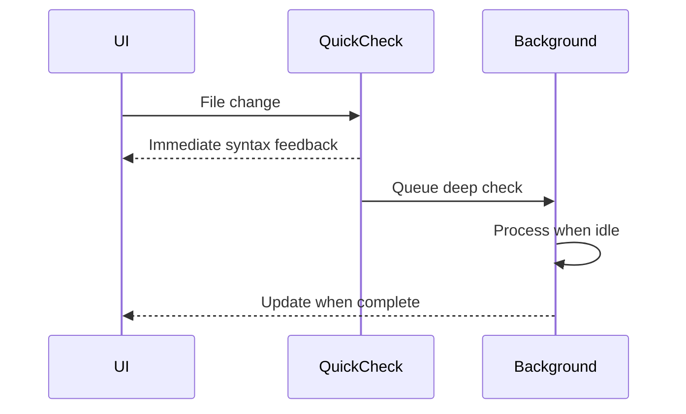

### Implementation Recommendations

1. **Add Debouncing**:
   ```jac
   @debounce(300.0)  // 300ms debounce
   async def launch_deep_check_debounced(self, uri: str) -> None {
       await self.launch_deep_check(uri);
   }
   ```

2. **Reduce Token Refresh Calls**:
   ```jac
   // Remove redundant refresh call
   if quick_check_passed {
       // ... semantic token update
       await ls.launch_deep_check(file_path);
       // Single refresh after deep check completes
   }
   ```

3. **Implement Change Coalescing**:
   ```jac
   def should_skip_deep_check(self, change: ChangeEvent) -> bool {
       return (
           change.is_whitespace_only() or
           change.is_comment_only() or
           change.size < MINIMUM_CHANGE_THRESHOLD
       );
   }
   ```

4. **Add Performance Monitoring**:
   ```jac
   async def launch_deep_check(self, uri: str) -> None {
       start_time = time.time();
       await self.deep_check_implementation(uri);
       duration = time.time() - start_time;
       self.log_py(f"Deep check took {duration}s for {uri}");
   }
   ```

## Conclusion

The Jac Language Server implements a robust file change handling system with clear separation between quick syntax validation and comprehensive semantic analysis. While the current implementation provides excellent functionality, there are opportunities for performance optimization, particularly around debouncing deep checks and reducing redundant semantic token refreshes.

The key insight is that the current system prioritizes correctness and completeness over performance, which is appropriate for development tools but could benefit from smart optimizations to improve user experience on larger projects.

### Key Takeaways

1. **Quick Check** provides immediate feedback (1-5ms)
2. **Deep Check** ensures correctness but is expensive (50-500ms)
3. **Semantic Tokens** are incrementally updated but may need full regeneration
4. **Performance** can be improved with debouncing and smarter change detection
5. **Architecture** is well-structured but could benefit from background processing

This analysis provides a foundation for future optimizations while maintaining the high quality of language server features that users expect.
