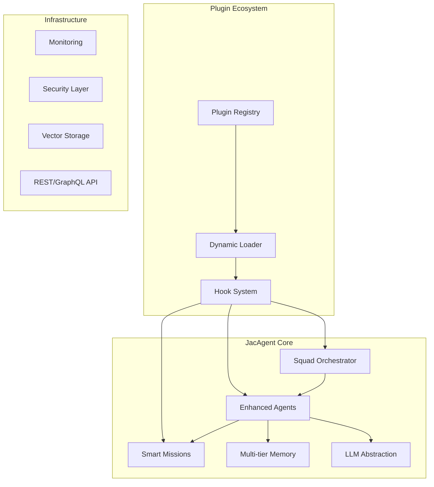

# JacAgent 🤖

**Next-Generation Agentic Framework with Enhanced Customization and Plugin Architecture**

JacAgent is a modern, extensible multi-agent framework designed for building sophisticated AI-powered applications with unprecedented customization capabilities and comprehensive plugin support.

## ✨ Key Features

- 🚀 **Modern Architecture**: Built with async-first design and type safety
- 🔌 **Extensive Plugin System**: 50+ hook points for complete customization
- 🎯 **Dynamic Agent Behaviors**: Runtime role switching and adaptive capabilities
- 🧠 **Advanced Memory Management**: Multi-tier memory with vector storage
- 🔄 **Flexible Orchestration**: Support for complex workflow patterns
- 📊 **Built-in Monitoring**: Real-time metrics and detailed tracing
- 🛡️ **Enterprise Security**: Comprehensive validation and audit trails
- 🎨 **Developer Experience**: Rich CLI, web UI, and debugging tools

## 🚀 Quick Start

```bash
pip install jacagent[llm]
```

```python
import asyncio
from jacagent import Agent, Squad, Mission, LLMProvider

# Create an agent with enhanced capabilities
agent = Agent(
    role="Data Analyst",
    persona="Expert statistician with deep domain knowledge",
    capabilities=["data_analysis", "visualization", "reporting"],
    llm=LLMProvider.openai("gpt-4"),
    plugins=["memory_enhanced", "tool_integration"]
)

# Define a mission with complex requirements
mission = Mission(
    objective="Analyze quarterly sales data and generate insights",
    success_criteria=["Statistical significance", "Actionable recommendations"],
    constraints={"max_time": 300, "data_privacy": True},
    output_format="structured_report"
)

# Create a squad for collaborative work
squad = Squad(
    agents=[agent],
    missions=[mission],
    orchestration="adaptive",
    memory_shared=True
)

# Execute with real-time monitoring
async def main():
    result = await squad.execute()
    print(f"Mission completed: {result.success}")
    print(f"Insights: {result.outputs}")

asyncio.run(main())
```

## 🔌 Plugin Ecosystem

JacAgent provides extensive hook points for customization:

### Core Hooks
- **Agent Lifecycle**: `before_agent_init`, `after_agent_ready`, `on_agent_error`
- **Mission Execution**: `before_mission_start`, `during_execution`, `after_completion`
- **LLM Integration**: `before_llm_call`, `response_processing`, `token_management`
- **Memory Operations**: `memory_store`, `memory_retrieve`, `memory_cleanup`

### Example Plugin
```python
from jacagent.plugins import BasePlugin, hook

class CustomBehaviorPlugin(BasePlugin):
    name = "custom_behavior"
    version = "1.0.0"
    
    @hook("before_mission_start")
    async def enhance_mission(self, mission, context):
        # Custom logic before mission execution
        mission.add_context("enhanced_mode", True)
        return mission
    
    @hook("after_llm_response")
    async def process_response(self, response, agent, context):
        # Custom response processing
        if agent.role == "analyst":
            response = self.add_statistical_validation(response)
        return response
```

## 📋 Comparison with Other Frameworks

| Feature | JacAgent | CrewAI | AutoGen | LangGraph |
|---------|----------|---------|---------|-----------|
| Plugin System | ✅ 50+ hooks | ❌ Limited | ❌ Basic | ❌ None |
| Async Native | ✅ Full | ❌ Partial | ❌ No | ❌ Partial |
| Dynamic Roles | ✅ Runtime | ❌ Static | ❌ Static | ❌ Static |
| Memory Tiers | ✅ Multi-tier | ❌ Basic | ❌ Simple | ❌ None |
| Monitoring | ✅ Built-in | ❌ External | ❌ Basic | ❌ None |
| Type Safety | ✅ Full | ❌ Partial | ❌ None | ❌ Partial |
| Web UI | ✅ Included | ❌ Separate | ❌ None | ❌ None |

## 🏗️ Architecture



## 🚦 Getting Started

### Installation

```bash
# Basic installation
pip install jacagent

# With LLM providers
pip install jacagent[llm]

# With vector storage
pip install jacagent[vector]

# Full installation
pip install jacagent[llm,vector,monitoring]
```

### Basic Usage

1. **Simple Agent Creation**
```python
from jacagent import Agent

agent = Agent.create(
    role="Assistant",
    persona="Helpful and knowledgeable",
    llm="openai:gpt-4"
)
```

2. **Advanced Squad Setup**
```python
from jacagent import Squad, Agent, Mission

# Create specialized agents
researcher = Agent.researcher(expertise="market_analysis")
writer = Agent.writer(style="technical")
reviewer = Agent.reviewer(criteria="accuracy")

# Define collaborative mission
mission = Mission.collaborative(
    objective="Create market analysis report",
    workflow=["research", "write", "review"],
    success_metrics={"accuracy": 0.95, "completeness": 0.90}
)

# Execute with monitoring
squad = Squad([researcher, writer, reviewer])
result = await squad.execute(mission, monitor=True)
```

## 📚 Documentation

- [Quick Start Guide](https://docs.jacagent.dev/quick-start)
- [Plugin Development](https://docs.jacagent.dev/plugins)
- [API Reference](https://docs.jacagent.dev/api)
- [Examples](https://docs.jacagent.dev/examples)
- [Migration Guide](https://docs.jacagent.dev/migration)

## 🛠️ Development

```bash
# Clone repository
git clone https://github.com/jacagent/jacagent.git
cd jacagent

# Install development dependencies
pip install -e .[dev]

# Run tests
pytest

# Format code
black jacagent tests
isort jacagent tests

# Type checking
mypy jacagent
```

## 🤝 Contributing

We welcome contributions! Please see our [Contributing Guide](CONTRIBUTING.md) for details.

### Plugin Development
Create plugins to extend JacAgent functionality:

```bash
# Create plugin template
jacagent create-plugin my-plugin

# Test plugin
jacagent test-plugin my-plugin

# Publish plugin
jacagent publish-plugin my-plugin
```

## 📊 Performance

JacAgent is designed for performance and scalability:

- **Async Processing**: Native async support for concurrent operations
- **Memory Efficiency**: Intelligent memory management and cleanup
- **Caching**: Multi-level caching for faster execution
- **Streaming**: Real-time streaming for long-running operations

## 🔒 Security

- **Input Validation**: Comprehensive input sanitization
- **Output Filtering**: Safe output generation with configurable filters
- **Audit Trails**: Complete execution logging and tracking
- **Rate Limiting**: Built-in protection against abuse
- **Encryption**: End-to-end encryption for sensitive data

## 📄 License

MIT License - see [LICENSE](LICENSE) file for details.

## 🙏 Acknowledgments

JacAgent is inspired by the excellent work of various multi-agent frameworks while providing enhanced customization and modern architecture patterns.

---

**Ready to build the future of AI agents?** [Get Started](https://docs.jacagent.dev) today! 🚀
